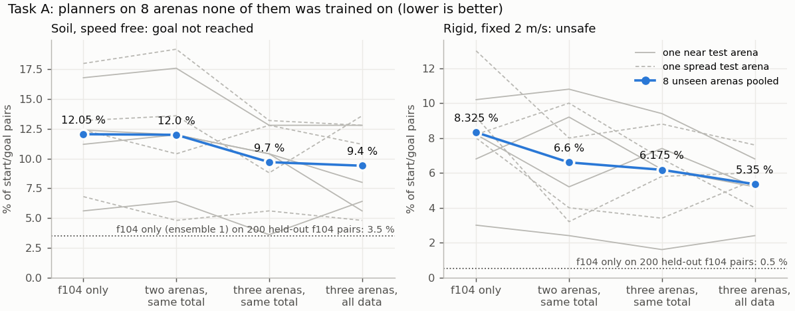
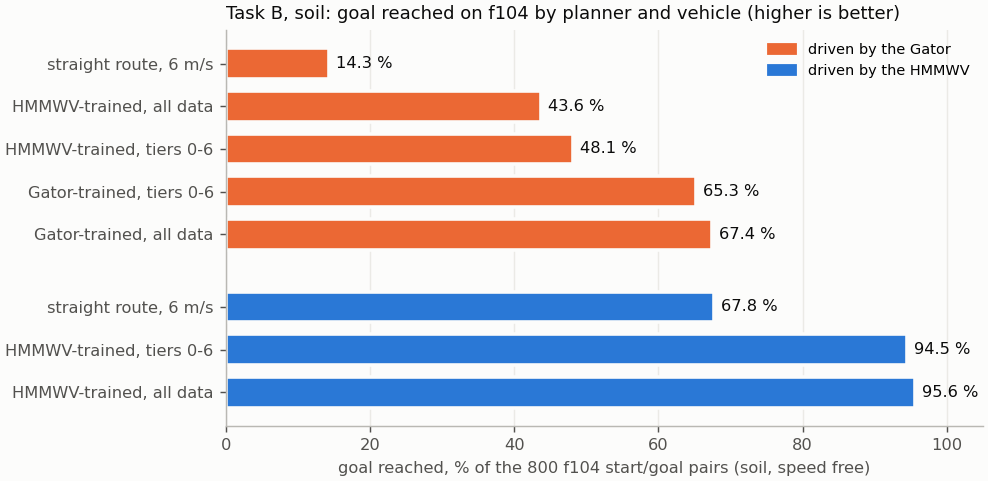
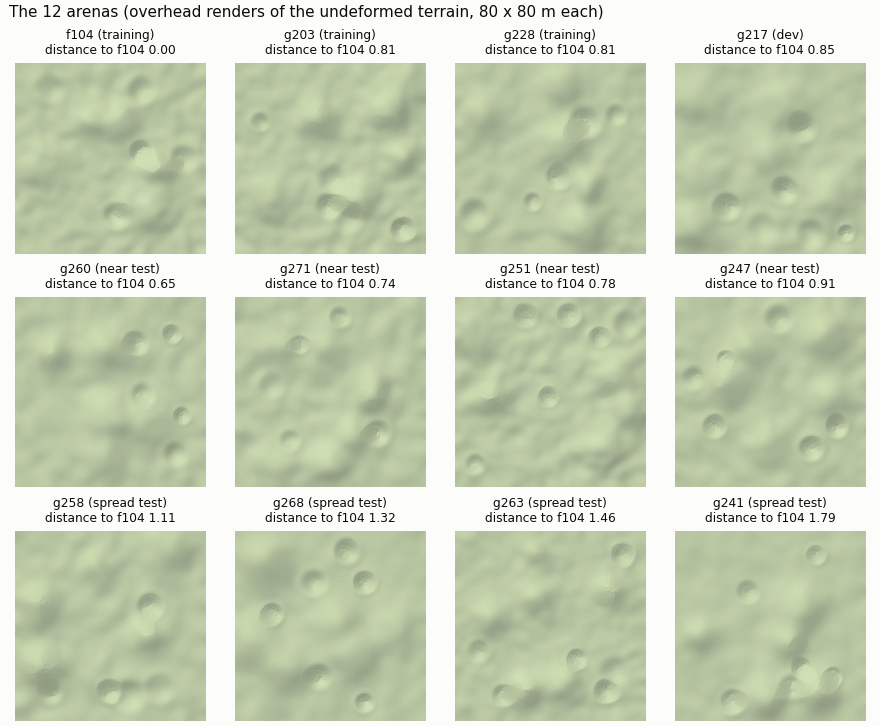

# REPORT: more training arenas (task A) and the Gator on f104 (task B), 2026-09-25/26

Branch `arena_gator_v1`. This folder (K3) = `artifacts/traverse/arena_gator_20260925/`; cluster root (G3) =
`/work1/dannegrut/harry/experiments/arena_gator_20260925`. Every number here is taken from `RESULTS_rigid.md`,
`RESULTS_soil.md`, `RESULTS_gator_full.md`, the collection records and the verifier reports (`VERIFY_*.md`). All three
results files were re-derived from the raw drive files by independent verifiers, and all three passed. Where a result
is weaker than its headline, the caveat is stated next to it.

## Short answer

| Question | Answer | Key numbers (8 never-seen test arenas unless named) |
|---|---|---|
| **A.** Does training on more arenas help on arenas the planner has never seen, **at the same total data**? | **Yes, a little, on both kinds of ground.** Both declared tests pass. | Soil, goal not reached: f104 only 12.05 % -> three arenas 9.70 % (-2.35 points, 90 % interval [-3.7, -1.1]). Rigid at a fixed 2 m/s, unsafe: 8.33 % -> 6.17 % (-2.15 [-3.4, -1.0]). |
| **A.** ... **with more data** (all the data of the three arenas)? | **Yes, by about the same amount.** The extra data adds little on unseen arenas. | Soil 9.40 % (-2.65 [-4.0, -1.3]); rigid 5.35 % (-2.98 [-4.1, -1.9]). All data vs same total: soil -0.3, rigid -0.83 points, both inside +-2 points. |
| **A.** Better **and better** as arenas are added (1 -> 2 -> 3)? | **Not shown.** Failures fall overall, but not step by step, and the two grounds disagree on which step helps. | Soil 12.05 -> 12.0 -> 9.7 % (all at the third arena). Rigid 8.33 -> 6.60 -> 6.17 % (mostly at the second). |
| **A.** Does the generalisation gap close? | **Partly.** Every planner still fails more on unseen arenas than on f104. | Unseen minus f104 itself: rigid +7.8 points (f104 only) -> +5.7 / +4.9; soil +8.0 -> +6.7 / +4.4. |
| **A.** Near vs spread test arenas? | **No clear difference.** | Soil gain -2.2 near vs -2.5 spread; rigid -0.9 vs -3.4 (difference not significant). |
| **A.** Rigid ground, speed free? | **At the ceiling; no harm.** | Goal not reached 0.25-0.65 % for every planner. |
| **B.** Can the Gator collect the same data on f104? | **Yes.** It drove every id, and every declared validity check passes. | Soil: 15,235 / 15,235 ids valid, 141.1 simulated h (HMMWV 91.5 h). Rigid: 24,000 / 24,000, 165.7 h (HMMWV 202.9 h). Belly-in-soil flag 8.5 % (limit 10 %). |
| **B.** How does the Gator behave on the same routes as the HMMWV? | **Soil: far worse. Rigid: better.** | Soil: goal not reached 88.2 % vs 68.1 %. Rigid: 6.6 % vs 19.9 %. |
| **B.** Does a Gator-trained planner work? | **Soil: it beats the straight route and the HMMWV-trained planner (both declared closed-loop criteria).** The offline criterion is met only on the small validation set. **Rigid: yes**, but rigid f104 cannot tell it apart from the HMMWV-trained planner. | Soil, all data: Gator-trained 67.4 % goal reached on the Gator, against 43.6 % for the HMMWV-trained planner and 14.3 % for the straight route. |
| **B.** Gator-trained vs HMMWV-trained, both driven by the Gator (declared primary) | **The Gator-trained planner is clearly better.** | Soil, all data: -23.8 points of failure [-30.4, -16.5], better on 206 pairs and worse on 16. Stage 1 (about half the data): -17.1 [-21.7, -12.5]. |
| **B.** Did the full amount of Gator data help over half of it? | **A small gain, marginal.** | 65.3 % -> 67.4 % goal reached (-2.1 points [-3.7, -0.5]). It passes the declared rule, but the pair-level 95 % interval reaches +0.1. |
| **B.** Compared with the HMMWV on its own planner? | **Falls well short.** | Gator 67.4 % vs HMMWV 95.6 % goal reached. Share of the straight route's failures removed: 62 % vs 86 %. |
| Cost | **113.3 billed node-hours** (sacct since 09-25 00:00; soft cap 150). | |

*Figure 1. Task A on the 8 never-seen test arenas. Thick line: all 8 arenas pooled. Thin lines: one arena each
(solid = near, dashed = spread). Dotted line: the f104-only planner on held-out start/goal pairs of f104 itself. The
straight route is off the scale (soil 40.0 % not reached; rigid at 2 m/s 54.5 % unsafe). Single arenas move by several
points, and so do two trainings on the same data (section 2.8), so only the pooled line carries weight.*

*Figure 2. Task B on f104 soil, 800 start/goal pairs, standing start. "Tiers 0-6" = the 8,399 drives of the first seven
routes of each start/goal pair; "all data" = all 15,235 drives. The HMMWV-trained planners pick the same routes for
both vehicles.*

## 1. What was done

**Questions** (PLAN section 0).
- A: the f104 work showed that one arena plus enough data gives a good planner on that arena. Does training on more
  arenas make the planner better on arenas it has never seen? Answer separately for more arenas at the same total
  data, and for more arenas with more data.
- B: with Chrono's Gator instead of the HMMWV on f104, can the same data be collected, and does it train a planner
  that works?

**Protocol (fixed before any model existed).**
- Every planner is a 5-seed ensemble of the same network: the CNN-GRU risk model, geometry context, 30 epochs. One
  model per ground type (soil or rigid). The planner plans once from a standing start by iterated sampling (4 rounds
  x 64 routes).
- Every model was retrained with the same recipe; no earlier checkpoint is compared.
- Picks were locked with sha256 before any drive, and the analysis specs were frozen before any outcome existed. The
  verifiers checked the order of events from the file times (section 7).
- Labels: **not reached** = goal not reached. **Unsafe** = not reached, or reached only after rolling backwards on a
  climb.

**Arenas** (Figure 3).
- Training: f104, g203 and g228. The two new ones are the two most f104-like arenas of the earlier 40 generated
  arenas (distance 0.81 from f104).
- Dev: g217.
- Test: 8 new arenas from new generator seeds, chosen by a script before anyone looked at them:
  - 4 near: the 4 closest to f104 (g260, g271, g251, g247; distance 0.65-0.91);
  - 4 spread: one per quarter of ranks 5-40 (g258, g268, g263, g241; distance 1.11-1.79).

**Test sets.**
- Rigid: all 250 start/goal pairs per test arena (2,000).
- Soil: a declared half of each arena, the 125 pairs with the lowest id hash (1,000).
- In distribution: 200 f104 hill/crater pairs; 150 held-out pairs each on g203 and g228.
- Task B: the 800-pair f104 suite.

**Models (plain label, code).**

| plain label | code | soil training data (tiers 0-6) | rigid training data |
|---|---|---|---|
| f104 only (two independent ensembles; their per-pair mean is the declared reference) | M1a, M1b, M1 | f104 1,089 groups, 29,210 fitted rows | f104 1,089 groups, 84,787 rows |
| two arenas, same total data | M2 | f104 545 + g203 545 groups | same split, 84,310 rows |
| three arenas, same total data (two ensembles; mean = M3) | M3a, M3b, M3 | 363 groups on each arena, 29,071 rows | 363 x 3 groups, 84,481 rows |
| three arenas, all data | A3 | 1,089 + 559 + 520 groups, 57,898 rows (about 2x) | 1,089 + 1,083 + 1,063 groups, 250,490 rows (about 3x) |
| Gator-trained | G (tiers 0-6), G_full (all tiers) | the Gator's own f104 drives: 8,399 / 15,235 | the Gator's 24,000 f104 drives |
| HMMWV-trained (task B) | H (= M1a), H_full | the HMMWV drives of exactly the same ids | = M1a (the file is byte-identical) |
| straight route (no model) | straight6 / straight2 | straight to the goal at 6 m/s | 6 m/s, or 2 m/s |

"Same total data" means the same number of training start/goal groups, not exactly the same rows. The soil models use
the first 7 of the 13 routes per group ("tiers 0-6") on every arena, so f104 was cut to match (PLAN 7.10, section 5).

**Statistics** (PLAN 7.3).
- One declared family of four primary tests: soil three arenas vs f104 only, soil all data vs f104 only, and the same
  two contrasts on rigid ground at a fixed 2 m/s (unsafe).
- One-sided p from a bootstrap over (arena, nearest terrain feature) clusters, with Holm correction at 0.05.
- "No meaningful difference" only if the 90 % interval lies inside +-2 points.
- Brackets are 90 % cluster-bootstrap intervals unless marked otherwise.

*Figure 3. The 12 arenas. Distance = the 8-statistic terrain distance to f104 used by the earlier new-arena study.*

## 2. Task A: more training arenas

### 2.1 More arenas at the same total data

| 8 unseen arenas | f104 only | two arenas, same total | three arenas, same total | three arenas, all data | straight route |
|---|---|---|---|---|---|
| soil, speed free: goal reached (1,000 pairs) | 87.95 % | 88.0 % | 90.3 % | 90.6 % | 60.0 % (6 m/s) |
| rigid, fixed 2 m/s: unsafe (2,000 pairs) | 8.33 % | 6.60 % | 6.17 % | 5.35 % | 54.50 % (2 m/s) |
| rigid, speed free: goal not reached | 0.62 % | 0.25 % | 0.33 % | 0.30 % | 1.60 % (6 m/s) |

**The declared family** (all four reject; Holm-adjusted p):

| test | difference, points | 90 % interval | Holm p |
|---|---|---|---|
| soil: three arenas, same total vs f104 only (not reached) | -2.35 (9.70 vs 12.05 %) | [-3.7, -1.1] | 0.0037 |
| soil: three arenas, all data vs f104 only | -2.65 (9.40 vs 12.05 %) | [-4.0, -1.3] | 0.0037 |
| rigid 2 m/s: three arenas, same total vs f104 only (unsafe) | -2.15 (6.17 vs 8.33 %) | [-3.4, -1.0] | 0.0037 |
| rigid 2 m/s: three arenas, all data vs f104 only | -2.98 (5.35 vs 8.33 %) | [-4.1, -1.9] | 0.0010 |

- **Size.** The gain is real but small: 19-22 % fewer soil failures, and 26-36 % fewer unsafe rigid drives at 2 m/s.
  The intervals reach down to 1.0-1.3 points (rigid with all data: 1.9), so a gain of 2 points or more is not shown.
- **What the rigid gain is made of.** Goal reaching does not change at 2 m/s (not reached 3.08 / 3.02 / 2.95 %, no
  meaningful difference). The whole gain is fewer drives that reach the goal only after sliding backwards on a climb
  (5.25 -> 3.15 -> 2.40 %). These are real events: a median of about 5 s rolling backwards, at a peak of about 2 m/s.
- **Speed free, rigid** is at the ceiling for every planner. Their differences (-0.3 to -0.65 points) all lie inside
  the 2-point band, so the extra arenas do no harm there. The three-arena planner at the same total takes 1.20 times as
  long as f104 only with one pair of ensembles and 1.11 with the other; with all data, 1.065.
- **Robustness.**
  - Every single-ensemble pairing points the same way. Soil: -1.8 to -3.2 points. Rigid: -1.95 to -3.05 points
    (exact McNemar p 0.0005-0.003).
  - The soil decisions do not depend on the rigid tests: with those entered as p = 1, the soil Holm p are 0.005.
  - They survive the estimated training noise, but not a noise twice as large in standard deviation (section 2.8).

### 2.2 More arenas with more data

- Adding all the data of the three arenas gives about the same gain over f104 only as three arenas at the same total:
  soil -2.65 vs -2.35, rigid -2.98 vs -2.15 points.
- Directly, all data vs same total: soil -0.3 [-1.6, +1.0] and rigid -0.83 [-1.5, -0.1]. Both lie inside +-2 points
  (the rigid one is detectable but small). So on arenas nobody trained on, doubling (soil) or tripling (rigid) the
  data on the same three arenas buys little beyond the variety itself.
- On the arenas the data came from, the extra data does help (section 2.5).

### 2.3 Dose response: one -> two -> three arenas at the same total

| | f104 only | + g203 | + g228 | slope per added arena [95 %] | step 1 -> 2 | step 2 -> 3 |
|---|---|---|---|---|---|---|
| soil, not reached | 12.05 % | 12.0 % | 9.7 % | -1.17 [-2.0, -0.4] | -0.05 [-1.6, +1.5] | -2.3 [-3.8, -0.8] |
| rigid 2 m/s, unsafe | 8.33 % | 6.60 % | 6.17 % | -1.08 [-1.56, -0.59] | -1.73 [-3.3, -0.3] | -0.43 [-1.6, +0.8] |

- Both slopes point down, but the steps do not repeat a pattern. On soil the second arena gives nothing and the third
  gives everything. On rigid ground the second arena gives most of the gain, and the third step is inconclusive.
- **"Better and better" is not shown.**
- Limits of this part of the design:
  - the arenas were added in one fixed order (g203, then g228), so "a third arena" cannot be told apart from "g228 in
    particular";
  - the two-arena model is a single ensemble;
  - the two steps were never tested against each other.

### 2.4 Near vs spread test arenas; distance and map error

- Soil, near vs spread:
  - three arenas at the same total: -2.2 vs -2.5 points (difference +0.3, 95 % [-2.8, +3.4]);
  - all data: -3.3 vs -2.0 points.
- Rigid, near vs spread:
  - three arenas at the same total: -0.90 [-2.21, +0.29] vs -3.40 [-6.23, -1.07]; the difference, +2.50
    [-0.22, +5.58], is not significant;
  - all data: -2.15 vs -3.80;
  - on the near arenas the same-total model alone is not distinguishable from f104 only.
- Per arena, 8 points, descriptive:
  - rigid gains grow somewhat with the distance to the nearest training arena (Spearman -0.55 / -0.48);
  - soil shows no clear trend (Pearson -0.32 / -0.22);
  - against each arena's map-lookup error (0.059-0.094 m): no clear relation in either world.
- Per-arena readings are noisy. On soil, two trainings of the f104-only planner on the same data differ by up to 6.4
  points on a single 125-pair arena. On rigid, the per-arena 95 % intervals exclude zero on 4 of 8 arenas. Only the
  pooled numbers carry weight.

### 2.5 The generalisation gap, before and after

| | f104 only (before) | three arenas, same total | three arenas, all data |
|---|---|---|---|
| rigid 2 m/s unsafe: unseen minus f104's own held-out pairs | **+7.83** [+6.5, +9.0] (8.33 vs 0.50 %) | +5.67 [+4.5, +6.8] | +4.85 [+3.3, +6.2] |
| soil not reached: unseen minus f104's own held-out pairs | **+8.0** [+4.6, +11.2] (11.5 vs 3.5 %; ensemble 1) | +6.7 [+3.5, +9.5] | +4.4 [+0.7, +7.6] |

(Gap intervals: 95 %, group bootstrap.)

- **Rigid.** The gap is not explained by harder terrain: the straight 2 m/s route is as hard on f104 (58 % unsafe) as
  on the unseen arenas (54.5 %). More arenas close about 28 % (same total) to 38 % (all data) of the gap (point
  estimates).
- **Soil.** The straight route also fails more on the unseen arenas (40.0 vs 34.5 %). Against it, the model-specific part
  of the gap cannot be told from zero. The all-data model's smaller gap comes partly from failing more on f104 itself
  (5.0 vs 3.5 %).
- **Knowing an arena is worth far more than knowing more arenas.** On the held-out pairs of g203 and g228, the
  multi-arena planners beat f104 only by 2-4 times the unseen-arena effect:
  - rigid 2 m/s unsafe 11.3 % (f104 only) vs 3.5 % (three arenas, same total) vs 1.7 % (all data), i.e. -7.8 and
    -9.7 points;
  - soil not reached 20.0 % vs 15.0 % vs 11.0 %, i.e. -5.0 and -9.0 points (single ensembles).

### 2.6 Offline evidence (ranking the routes of a start/goal pair, within-pair AUC of "unsafe", standing start)

- **Unseen-arena AUC, rigid only** (12 designed routes on each of the 2,000 unseen pairs, driven in the collection):
  - f104 only 0.947 / 0.944 (the two ensembles);
  - two arenas 0.952; three arenas at the same total 0.952 / 0.952; all data 0.956.
  - Paired: same total vs f104 only +0.0064 [+0.0035, +0.0092]; all data +0.0102 [+0.0070, +0.0132] (95 %).
  - The two f104-only ensembles differ by +0.0035, about half the same-total gain.
  - The f104-only planner scores 0.983 on f104's own validation pairs and 0.946-0.948 on g203 / g228.
  - Soil has no offline read-out on the test arenas: no designed routes were driven there on soil.
- **Learning curve (f104 only, more f104 data).**
  - Rigid, unseen arenas: 213 / 431 / 865 fitted groups give 0.933 / 0.941 / 0.944, a small rise that flattens.
  - Soil, on the other two training arenas: 272 / 545 / 1,089 groups give 0.924 / 0.939 / 0.943 (g203) and
    0.913 / 0.917 / 0.939 (g228). f104 only is still somewhat data-limited off f104.
- **Leave one arena out** (about 545 groups; the held-out arena is scored).
  - Rigid, on the training arenas: two arenas rank the left-out third no better than the better single arena
    (+0.001 to +0.003), and 2.2-3.5 points below the in-arena score.
  - Rigid, on the 8 unseen arenas: two arenas at about 435-449 groups score 0.945-0.949, against 0.939-0.944 for one
    arena at a similar size.
  - Soil: mixed, +0.016 (g228 left out), +0.006 (g203), -0.012 (f104).
- **Reading.** The offline picture matches the closed loop. There is a clear gap between an arena seen in training and
  one not seen. Variety gives a small gain, not much larger than the difference between two trainings. More data from
  the same arena closes little of the gap.

### 2.7 No harm on f104, and the dev arena

- **f104's own 200 held-out pairs.**
  - Rigid 2 m/s: 0.50 % unsafe for f104 only, three arenas at the same total and all data alike; speed free 0 %
    not reached. No harm.
  - Soil, three arenas at the same total: 3.0 vs 3.5 %. It is not worse by more than 2 points by the cluster bound
    (+1.5), but the group-bootstrap bound sits exactly at +2.0.
  - Soil, all data: 5.0 vs 3.5 %. Non-inferiority is not shown (upper bound +2.9), but there are only 6 vs 3
    discordant pairs, so there is no evidence of harm either.
- **Dev arena g217** (an easy unseen arena).
  - The frozen f104-only soil planner reaches 95.3 % there, as on f104 (95.8 %). This is why the 4 spread arenas were
    added (PLAN 7.1). On those it reached 85.3-94.7 %.
  - Rigid 2 m/s: three arenas at the same total 3.33 vs 3.00 % unsafe (no meaningful difference); all data 1.33 vs
    3.00 % (inconclusive).

### 2.8 Caveats for task A

1. **The training arenas are the two most f104-like** of the earlier 40 arenas, so three arenas is a small step in
   variety. The near test arenas are about as close to f104 as g203 and g228 are.
2. **Map-lookup error.** Every planner reads heights from one overhead depth capture with a flat-ground lookup. Its
   error grows with relief: f104 0.050 m, g203 0.062, g228 0.072, test arenas 0.059-0.094 m. The per-arena gains show
   no clear relation to it. The planned offline check that would separate "robust to map error" from "terrain variety"
   (retraining on exact-height corridors, REVIEW_R1 item 8) was not done.
3. **Soil stage-1 cut.** Every soil model uses routes 0-6 of 13 per group (about 29,000 fitted rows at the same total)
   on every arena. The g228 soil pool gave only 520 training groups, not 545. The remaining soil routes (tiers 7-12 of
   g203 and g228) were collected but not used for task A.
4. **Seeds.** Only f104 only and three arenas at the same total have two independent ensembles.
   - Soil: the two f104-only ensembles differ by 1.1 points pooled (up to 6.4 on one arena).
   - Rigid: 0.15 (f104 only) and 0.25 (three arenas) points.
   - The soil tests survive the estimated training noise and about 1.4 times that noise, not twice (in standard
     deviation).
   - The two-arena and all-data models are single ensembles.
   - Rigid ensembles were trained on two GPU types (MI350X and MI250X).
5. **Test arenas chosen by rule**, before any look. The 4 near arenas are the closest to f104 and the 4 spread arenas
   come from ranks 5-40. All are from the same terrain generator, so this is interpolation within one family of
   hills and craters, not new kinds of terrain.
6. **The fixed-2 m/s rigid read-out is a planner-choice test.** The planner chooses only the path, and the gain is in
   slide-backs, not in reaching the goal. Speed free, the rigid question has no room.

## 3. Task B: the Gator instead of the HMMWV on f104

### 3.1 What was collected ("the same amount" = the same task ids)

| | soil (15,235 HMMWV `collect_v1` ids, tiers 0-12) | rigid (the 24,000-route pool behind every rigid f104 model) |
|---|---|---|
| ids driven and validated | 15,235 / 15,235 (100 %) | 24,000 / 24,000 (100 %) |
| crashed / non-finite states | 0 | 0 |
| launch-check failures (limit < 5 %) | 0 | 0 (native-height check 0 failures) |
| rollovers | 0 | 46 (0.19 %) |
| body problems | belly-in-soil flag 8.5 % (limit 10 %; 10.1 % on the designed routes alone); every flagged drive failed anyway | chassis touches the ground on 9.0 % of routes; lowest hull point below the surface on 7.8 % (down to -0.38 m) |
| simulated hours, Gator vs HMMWV | **141.1 h vs 91.5 h** (1.54x: stalled drives run to the 34 s stop rule) | **165.7 h vs 202.9 h** (fewer failures; on routes both complete, the Gator is about 4 % quicker) |
| training rows | 55,826 (stage 1: 30,827) | 93,551 |

- **Declared "collects the same data" criteria (PLAN 7.7) are met in both worlds:** at least 95 % of ids valid, under
  1 % crashed, under 5 % launch-check failures, and the belly flag at or below 10 % of soil drives.
- **The pilot came first** (144 soil and 288 rigid routes, 02:31-04:29 on 09-25).
- The HMMWV-trained comparison planner was trained on exactly the ids the Gator validated. Because every id
  validated, that file is byte-identical to the HMMWV f104 file, so H is the f104-only ensemble 1.

### 3.2 The Gator vs the HMMWV on identical routes

| | soil: goal not reached, Gator / HMMWV | rigid: goal not reached | rigid: unsafe |
|---|---|---|---|
| all routes | **88.2 % / 68.1 %** (3,263 routes fail only for the Gator, 201 only for the HMMWV) | **6.6 % / 19.9 %** (667 / 3,857) | 11.3 % / 36.8 % |
| constant 2 m/s | 91.3 / 86.2 | 10.9 / 26.6 | 15.7 / 55.5 |
| constant 4 m/s | 83.8 / 56.3 | 1.2 / 8.2 | 4.2 / 19.8 |
| constant 6 m/s | 82.7 / 33.5 | 0.6 / 0.9 | 0.9 / 1.5 |
| smooth 2-6-2 m/s | 84.2 / 54.5 | 1.5 / 7.1 | 2.5 / 16.9 |
| planner proposals | 92.2 / 83.9 | 11.1 / 33.7 | 19.4 / 56.9 |

- **Soil.** The Gator stalls with its rear wheels spinning on climbs the HMMWV completes.
  - Speed does not rescue it: at 6 m/s it fails 83 % against the HMMWV's 34 %.
  - In 693 of the 1,200 groups every one of its routes fails (HMMWV: 180).
  - Causes: rear-wheel drive only, small wheels, and a one-gear 14 kW engine (HMMWV 81 kW). Its labels are therefore
    close to saturated. The failure rate is flat across tiers (87.3-89.3 %).
- **Rigid.** The lighter Gator (906 kg) fails less and slides back far less, above all at low speed. The HMMWV
  comparison drives come from the earlier production collection on other nodes; a same-node re-drive of 288 of these
  routes reproduced them exactly, and the vehicle difference is far larger than any node effect seen.

### 3.3 Does the Gator-trained planner work? (declared criteria, PLAN 3)

**Soil, 800 f104 pairs, all planners driven by the Gator unless named:**

| planner (plain label) | goal reached | not reached |
|---|---|---|
| Gator-trained, all data (G_full, 15,235 drives) | **67.4 %** | 32.6 % |
| Gator-trained, tiers 0-6 (G, 8,399 drives) | 65.3 % | 34.75 % |
| HMMWV-trained, all data (H_full) | 43.6 % | 56.4 % |
| HMMWV-trained, tiers 0-6 (H) | 48.1 % | 51.9 % |
| straight route, 6 m/s | 14.3 % | 85.75 % |
| *driven by the HMMWV:* HMMWV-trained, all data / tiers 0-6 / straight 6 m/s | 95.6 % / 94.5 % / 67.8 % | 4.4 / 5.5 / 32.2 % |

| criterion | stage 1 (tiers 0-6) | all data |
|---|---|---|
| (1) beats the straight route on the Gator | yes: -51.0 points [-55.5, -46.1] | yes: -53.1 [-58.4, -47.3] |
| (2) beats the HMMWV-trained planner on the Gator, or within 2 points (declared primary) | yes: -17.1 [-21.7, -12.5], 159 pairs better / 22 worse | yes: **-23.8 [-30.4, -16.5]**, 206 / 16, Holm p 0.001 |
| (3) offline within-pair AUC >= 0.95 on held-out groups | only on the 56 validation groups (0.952); 0.925 on the larger dev + validation set | only on the validation groups (0.950, resting on the 22 of 56 groups that have both outcomes); 0.946 on dev + validation |
| (4) share of the straight route's failures removed, vs the HMMWV's own planner on the HMMWV (reported, no threshold) | 59 % vs 83 % | 62 % [58, 66] vs 86 % [82, 91] |

- **The Gator-trained planner works.** It clearly beats the straight route and the HMMWV-trained planner on the
  Gator (all data: better in all 9 terrain clusters). On pairs both complete, its drives take 0.89 times as long as
  the HMMWV-trained planner's.
- **Why the HMMWV-trained planner fails on the Gator.** It does not know the vehicle. Its picks carry a predicted risk
  of 0.2-0.45 %, yet fail on 52-56 % of the pairs when the Gator drives them. Each vehicle's model ranks the other
  vehicle's outcomes poorly offline: 0.81-0.85 against 0.95-0.98 on its own vehicle.
- **Full volume vs stage 1** (-2.1 points [-3.7, -0.5], Holm p 0.018): improves by the declared rule, but marginally.
  - The pair-level 95 % interval is [-4.5, +0.1], and McNemar gives 52 pairs better vs 35 worse (p 0.086).
  - Only 5 of 9 clusters get better.
  - There is one ensemble per model, trained on different GPU types, so training noise is unmeasured.
  - Offline, the held-out ranking rose by 0.010 (0.936 -> 0.946).
  - Near-saturated labels limit what more of the same routes can teach.
- **More HMMWV data made the HMMWV-trained planner slightly better on the HMMWV** (95.6 vs 94.5 %, weak) **and worse
  on the Gator** (43.6 vs 48.1 % goal reached; +4.5 points of failure, 95 % [+1.8, +7.3]; single ensembles, training
  noise unmeasured). So the Gator-trained planner's lead grew from 17 to 24 points, mostly for this reason.
- **Rigid, 800 f104 pairs.**
  - Speed free, both planners saturate on the Gator: Gator-trained 100.0 %, HMMWV-trained 99.9 % goal reached
    (HMMWV-trained on the HMMWV 100.0 %).
  - At a fixed 2 m/s (added by the declared ceiling rule): Gator-trained 0.12 % unsafe, HMMWV-trained 0.12 %,
    straight 2 m/s 15.5 %.
  - Criteria: (1) yes at 2 m/s (speed free only 3 pairs separate it from the straight route); (2) yes; (3) 0.972 on
    the Gator's validation routes; (4) 99-100 % of the straight route's failures removed.
  - Rigid f104 has no room to separate the two planners.

### 3.4 Modelling caveats (stated deviations from a real Gator and from the HMMWV set-up)

1. **Stock Chrono Gator** (`veh.Gator`, 906 kg):
   - limited-slip rear-wheel drive, rear brakes only (the vehicle creeps at the start, up to 0.39 m/s);
   - one-gear 200 N m / 14 kW engine (top speed about 8 m/s);
   - wheel radius 0.286 m front / 0.318 m rear (HMMWV 0.47 m);
   - stock TMEASY tyres on rigid ground.
   Route limits, follower gains, labels and stop rules are the HMMWV's, unchanged; nothing was tuned for the Gator.
2. **Soil wheels are a stand-in.** The stock tyre meshes are not watertight, so each soil contact wheel is a plain
   cylinder 0.09 m smaller than the stock radius (0.196 m front, 0.228 m rear). The radius was calibrated so the
   settled sinkage matches the HMMWV's.
   - The result depends on this choice: on the 144 pilot routes, wheels 0.08 m larger cut the Gator's failure rate
     from 93.8 % to 80.6 % (-13.2 points; 20 routes flip to goal, 1 the other way).
   - That is just under the declared 15-point threshold for "the result depends on the wheel model".
3. **The body is not coupled to the soil** (as for the HMMWV), so the hull can pass into the ground without resistance.
   The belly-in-soil flag is 8.5 % of the collection drives, and every flagged drive failed anyway. It is 1.5-3.1 % on
   the planners' evaluation drives and 11.1 % on the straight route.
4. **Other set-up changes.**
   - The spawn height is 0.35 m above the ground (at 0.75 m the vehicle was still bouncing when the drive began).
   - 24 suspension telemetry fields are empty (not-a-number) for the Gator; its suspension is not the HMMWV type.
     Unused by labels and models.
5. **Training platform.** Stage-1 soil models were trained on MI250X and the all-data models on MI350X; the recipe
   and trainer file are the same.

## 4. Timeline

**2026-09-25**

| time | what |
|---|---|
| 00:00-01:10 | progress document updated, `crm_improve_v1` pushed; scout reports |
| 01:25-01:31 | PLAN written; design review and engineering review |
| 01:19-01:53 | 4 near test arenas chosen, maps and cases built; Gator vehicle switch (HMMWV path checked bit-identical) |
| 01:53-02:19 | HMMWV rigid and soil collections for g203 / g228 launched; dev-arena check: no soil gap on g217 |
| 02:35 | plan amendments: 4 spread test arenas, one test family, declared Gator criteria, second ensembles |
| 02:31-04:31 | Gator pilot (144 soil + 288 rigid routes, then the wheel-radius pilot): go, with caveats |
| 02:52-04:15 | first rigid models (f104 only, two ensembles) |
| 04:48-05:11 | soil relaunch with the Gator ids interleaved by tier; rigid Gator pool run inside the soil jobs |
| 05:21-05:50 | evaluation tools written |
| **05:50-10:50** | **unplanned shutdown of the working session; the cluster jobs kept running** (rigid data finished, soil tiers 0-3 done) |
| 10:54-10:58 | resumed; soil stage-1 cut at tiers 0-6 (PLAN 7.10) |
| 11:05-12:43 | remaining rigid models on MI250X (no MI350X free); soil task A models 11:27-11:59 |
| 13:13 | verifiers pass the rigid training and the evaluation tools |
| 13:26 | rigid analysis spec frozen |
| 13:41-15:21 | 42,645 rigid evaluation drives |
| 13:33-14:01 | Gator soil tiers 0-6 complete; Gator-trained soil planner trained |
| 14:10 | rigid task B at the ceiling, so fixed 2 m/s arms added (spec addendum frozen first) |
| 14:17 | verifier passes soil stage 1 |
| 14:34 / 14:40 / 14:41 | soil picks locked / soil spec frozen / first soil evaluation drive |
| **~14:45 (09-25) - 19:00 (09-26)** | **usage-limit pause of the working session. It did not stop the cluster:** every soil evaluation drive and the remaining training tiers (g203, g228 and all 15,235 Gator ids) finished by 23:33 on 09-25 |

**2026-09-26**

| time | what |
|---|---|
| 19:18 | resumed; queue empty; 108.2 billed so far |
| 19:20-19:36 | rigid and soil analyses under the frozen specs |
| 19:28-19:48 | Gator- and HMMWV-trained soil planners on all tiers; their spec frozen 19:29 |
| 19:56 | rigid and soil results verified |
| 19:59 / 20:01-21:20 | all-tier picks locked / 2,318 new soil drives |
| 21:26 / 21:45 | all-tier results written / verified |
| from 21:47 | this report, figures, progress document |

## 5. What was cut or changed, and why

| item | what happened | why |
|---|---|---|
| Soil training depth for task A | every soil model uses tiers 0-6 (7 of 13 routes per group); f104 cut to match | soil throughput was about 5 simulated h per wall hour at the start (not the 18 planned), and the session was down 05:50-10:50 (PLAN 7.10) |
| An all-tier task A soil retrain (three arenas, all data) | not done, although g203 / g228 tiers 7-12 were collected by 23:33 | the resumed session spent its full-volume retrain on task B, which asked for the same amount of data |
| Soil test size | 125 of the 250 pairs per test arena (1,000) | soil drive cost; declared before any drive (PLAN 7.1) |
| Soil offline read-out on the test arenas | none | it needs designed-route soil drives on the test arenas (about 12,000 more) |
| Offline map-error check (exact-height corridors) | not done | time; the per-arena effect vs map error is reported instead |
| Hill-weighted test suites (REVIEW_R1 item 9) | not adopted | the suites were locked at 01:28, before the review |
| Moving-start decision protocol | not used; standing start only | its tooling is hard-wired to f104 and doubles the drives (PLAN 1.1) |
| Second ensembles | only f104 only and three arenas at the same total | compute; M2, A3, G, G_full and H_full are single ensembles |
| The 12:00 collection stop | dropped | collection continued until each tier completed (PLAN 7.8) |
| Rigid task B | fixed 2 m/s arms added | speed free saturated (declared rule; threshold 99 %, amended from 97 % before any drive) |
| HMMWV-trained task B models | not retrained at stage 1 (= f104 only, ensemble 1) | the Gator validated every id, so the data file is byte-identical |

Other declared deviations:
- the rigid add-on spec was written while the outcome files were being copied (its "no outcome seen" rests on the
  analyst's record);
- an extra arm (the all-data HMMWV-trained planner on the HMMWV) was declared in the frozen spec before any drive;
- the stage-2 spec was written with the stage-1 task B outcomes known (disclosed in the spec).

## 6. Cost

**113.29 billed node-hours** from sacct since 09-25 00:00 (`scripts/ag_bf_billed.py`, the partition weights measured
in NOTES_S1 section 2; queue empty at 21:47 on 09-26). Soft cap 150, hard cap 180.

| purpose | billed node-hours |
|---|---|
| soil collection (g203 / g228 training tiers 0-12, all 15,235 Gator ids, spread headroom check) and all 12,310 stage-1 soil evaluation drives, 09-25 | 98.00 |
| rigid HMMWV collection (g203 / g228 pools, designed routes on the test arenas, drift check) | 6.45 |
| task B stage-2 soil drives, 09-26 | 5.04 |
| training (all rigid and soil models) and GPU probes | 2.96 |
| Gator pilot, smoke and drift checks | 0.85 |

- By partition: mi2104x 48.23, mi2101x 36.23, mi2508x 21.86, mi3501x 6.57, devel 0.41.
- The rigid Gator pool (24,000 drives), the 12,000 spread designed routes and all 42,645 rigid evaluation drives ran
  as extra steps inside the soil allocations' idle CPU cores, at no extra billing. The soil slowdown was measured each
  time and stayed well under the 10 % rule.
- Picks, offline scoring, analyses and all verifications ran on the workstation or read-only on the login node.

## 7. The checks behind the numbers

- Each module had an independent verifier: E1, E1b, E2, E4, E5a, E6a, S1, the rigid results, the soil results and task
  B stage 2 (`VERIFY_*.md`). All passed.
- The three final verifiers recomputed the results from the raw drive files with their own code:
  - labels of all 42,645 rigid drives: 0 disagreements;
  - every soil rate: equal;
  - the four family tests: reject in every variant of their own bootstrap;
  - task B: all 6,400 arm results matched to their drives by route content, without the study's mapping files.
- They re-derived every pick lock and checked that each lock and frozen spec predates the first drive of its set.
  The closest margin: the rigid held-out set was locked 38 s before its first drive.
- They fixed 38 overstated or wrong passages in the results files (16 rigid, 11 soil, 11 task B). None changed a
  declared decision.
- **Evidence limit.** The ordering rests on file times, job records and the log; there is no external timestamp.

## 8. Artefact map (paths under K3 unless marked)

| what | where |
|---|---|
| plan (with amendments 7.1-7.10), log, reviews, scouts | `PLAN.md`, `PLAN.sha256`, `LOG.md`, `REVIEW_R1.md`, `REVIEW_R2.md`, `scout/` |
| results and their verifications | `RESULTS_rigid.md` (+ `RESULTS_rigid.json` digest), `RESULTS_soil.md`, `RESULTS_gator_full.md`; `VERIFY_rigid_results.md`, `VERIFY_soil_results.md`, `VERIFY_gator_full.md` |
| module notes and verifications | `NOTES_E1/E1b/E2/E3a/E3b1/E3b2/E4/E5a/E6a/S1/S2.md`, `VERIFY_E1/E1b/E2/E4/E5a/E6a/S1.md` |
| this report's figures | `figures/` (`scripts/ag_report_figures.py`; numbers in `figures/figures_numbers.json`) |
| arena selection, distances, map-lookup error | `arenas/`; arena bitmaps in `assets/traverse/arena_g*` |
| suites and declared subsets (manifests with lock hashes) | `suites/`; case definitions and seeds: `cases/README.md` (cases regenerate byte-identically from the seeds; the files and the per-file lock lists are local) |
| maps | `maps/arena_*/observation.json` (+ local `observation.npz`, `rgb.png`), `grids/` (local) |
| task files | `e3/tasks/*.json` (local; `*.meta.json` and `*_check.json` in git); cluster copies `G3/tasks/` |
| collection read-outs | Gator pilot `e3/pilot_gator_eval.{json,txt}`; rigid Gator vs HMMWV `e6/collection/rigid_f104_gator_vs_hmmwv.json`; test-arena feasibility `e6/collection/test_designed_feasibility.json`; soil Gator all tiers: numbers in `RESULTS_soil.md` 3.3, per-id tables local (`e5/ids_bf/`, `e6/analysis/s2b/`) |
| datasets | local `e4/` (records and manifests in git), cluster `G3/e4/` |
| models | local `e5/deploy/<model>/` (checkpoints local; `SHA256SUMS`, training records and the manifests `soil_s1_models.json`, `soil_bf_models.json` in git); training runs `e5/train/` (local), job lists `e5/jobs/`, logs `e5/logs/` |
| offline read-outs | `e5/offline/` (training arenas, task B), `e6/offline/offline_unseen.{md,json}` (rigid, unseen arenas) |
| picks | local `e6/picks/` (locks `e6/picks/LOCK_*.{json,sha256}`, `rerun_sample.json`, `jobs_*.txt` in git) |
| evaluation rows and drives | `e6/tasks/` (meta in git); drive index files local `e6/runs_rigid/`, `e6/runs_soil/`; indexes `e6/index/` (local); cluster `G3/rigid_eval/`, `G3/soil_v1/runs/` |
| frozen specs and analysis outputs | `e6/analysis/spec_*.json`, `results_*.{json,txt}`, `family_*.json`, `rigid_tables.md`, `soil_extras_*.json`, `s2b/` |
| scripts | `scripts/ag_*` (new; no existing script edited in this session) |
