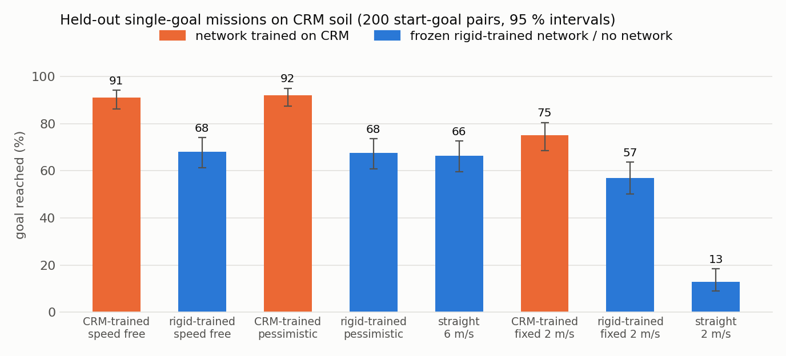
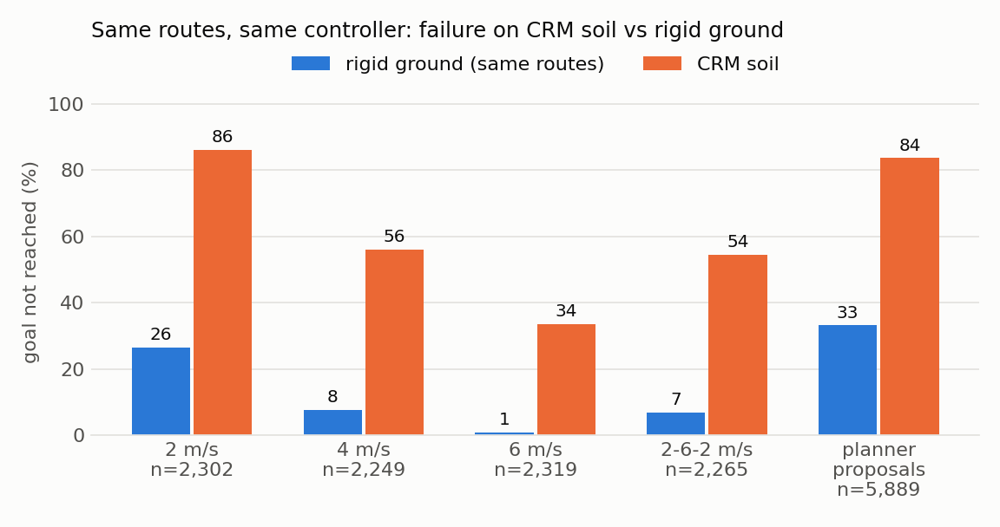

# HMMWV on CRM soil, f104 arena — night of 2026-09-16/17

Everything was pre-declared in `PLAN.md` (hash chain in `PLAN.sha256`, two dated amendments); the running record is `LOG.md`.
Local root `artifacts/traverse/crm_f104_v1/`, cluster root `/work1/dannegrut/harry/experiments/crm_f104_20260916/`.

## 1. Headline numbers

| | |
|---|---|
| Validated CRM driving | **91.51 simulated hours**, 15,235 episodes (collected 00:00-02:39, ~36 simulated hours per wall hour on ~111 AMD GPUs, 0 crashed episodes) |
| Splits by start-goal group | training 83.08 h / 13,821 episodes / 1,089 groups; validation 4.33 h / 713 / 56; test 4.10 h / 701 / 55 |
| Outcome mix | goal reached 31.9 %, not reached 68.1 % (designed routes 57.6 %, planner-proposal routes 83.9 %) |
| Training | existing network, from scratch, every training-split route (13,821), 5 seeds, MI350X, ~75 s per seed — **done** |
| Offline, never-fitted validation+test groups | ranking failures: AUC 0.988 (within a start-goal group 0.986; same speed profile 0.955); frozen rigid network on the same routes 0.910 / 0.883 |
| **Held-out single-goal CRM missions (200 new start-goal pairs, same arena)** | **goal reached 91.0 % with the CRM-trained planner vs 68.0 % with the frozen rigid-trained planner**; difference 23.0 points; 47 pairs where only the CRM-trained planner arrived vs 1 the other way. Pre-registered pair-level test: exact McNemar p = 3.5e-13, CI [17.0, 29.0]. The pairs are NOT independent (failures sit at ~12 spots on 9 terrain features): clustered by terrain feature the interval is [12.7, 35.4] and p ~ 0.003-0.008. The direction is robust; the 1e-13 is not the honest strength of evidence. |
| Driving content of the 91.5 h | goal-reaching episodes 22.5 h; bogged episodes 69 h, of which >= 29 h is a stationary vehicle spinning its wheels; 419.7 km in total (mean 1.27 m/s) |
| Cluster cost | ~37 billed node-hours (allocation 396 -> 433 of 1,500) |

## 2. What was built

- **CRM episode collector** `scripts/crm_collect.py`. Soil terrain is built from the same f104 BMP (same height range,
  same orientation and pixel convention as the rigid terrain; checked on the initial particle lattice, y-mirrored control
  1.23 m rmse). It IMPORTS the rigid collector's controller, route reader, stop rules and file schemas instead of copying
  them, so the controller (path follower gains, 5 m look-ahead, 2 /s steering rate limit, 0.8 s braked settle, 50 ms
  control period), the goal / rollover / bounds / prolonged-blockage rules, the 17-field state, the action columns and
  every file the labeller reads are unchanged. Fresh terrain per process = soil reset between episodes.
- **Reference depth image** rendered once on luffy with OptiX (`scripts/crm_capture_map_local.py` ->
  `maps/arena_f104_50h_v1/`, world grid in `grids/`): vs the stored AMD render median 7.6e-6 m / max 4.6e-5 m, identical
  valid mask; height vs the BMP 0.0038 m rmse in Chrono's frame. All corridors (training and planning) are cut from it.
- **Parallel collection** `scripts/crm_worker.py` + `crm_collect.sbatch` + `crm_launch.sh`: one process per GPU, `mkdir`
  claims with heartbeat and stale take-over, atomic completion marker, resumable, a `STOP_CLAIMS` file to stop; 24,000
  tiered tasks (`crm_tasks.py`) with unique ids and `episode_seed`s so an early stop stays balanced (12-13 routes in
  every one of the 1,200 groups). Routes: the night-2 pool reused verbatim - 3 lateral offsets x 4 speed profiles plus
  8 planner-proposal routes per start-goal pair - so every CRM episode has a rigid twin with the same id.
- **QA** `scripts/crm_qa.py` -> `collect_v1/qa.json`; **dataset** = the unchanged labeller `scripts/f104_n2_dataset.py`;
  **trainer** `scripts/crm_train.py` (the existing trainer with the masks changed to "all training-split rows");
  **evaluation** `scripts/crm_pools.py` (identical 256-candidate pools for both networks, picks hashed before driving)
  and `scripts/crm_analyze.py`.

Physics settings (frozen in `configs/crm_main.json`, identical for collection and evaluation): particle spacing 0.08 m
(4.0 M particles over the whole 80 x 80 m arena), soil depth 0.24 m, density 1700 kg/m3, cohesion 5 kPa, friction 0.8,
Young 1 MPa (the repo's earlier CRM setting = Chrono's vehicle demo), rigid-mesh tyres coupled to the soil, 1 ms step.

## 3. Pilot findings that shaped the run (311 episodes)

- CRM runs on MI210, MI300X and MI350X and the same episode is **bit-identical across the three GPU types** (unlike the
  rigid runs, which differ between node types). Real-time factor at 1 ms: 0.32 (MI210) to 0.50 (MI350X); one process
  per GPU (four on one GPU are 9x slower each); cropping the soil domain does not pay.
- 1 ms vs 0.5 ms step on 142 shared episodes: same goal-reached outcome in 96.5 %, failure 64.8 % vs 64.1 %, time to
  goal +0.05 s -> 1 ms adopted by the pre-declared rule. Spacing 0.06 m vs 0.08 m: 25 / 25 same outcome.
- **CRM is a much harder world than rigid ground for the same routes and controller** (full data, rigid twin in brackets):
  2 m/s 86 % not reached (26 %), 4 m/s 56 % (8 %), 6 m/s 34 % (1 %), 2-6-2 m/s 54 % (7 %), planner proposals 84 % (33 %).
  Mechanism: the vehicle loses speed on a 10-25 degree grade, stalls at full throttle, one wheel spins freely (open
  differentials, slip ratio in the hundreds) and digs in.
- Simulator artefact found and handled: that spinning wheel excavates the whole soil layer in 10-15 s and the vehicle
  then drops through the floor (boundary particles hold soil, not tyres), which the old rules read as a rollover. New
  terminal status `soil_breakthrough_terminated` (counted as goal not reached). All 8,372 such endings in the collection
  and all 381 in the evaluation were preceded by a stall; 1 episode (a wheel punching through at speed) was quarantined.

## 4. Goal-reaching results on held-out single-goal CRM missions

200 new hill / crater start-goal pairs on the same arena (>= 2.03 m from every training pair in start+goal space, median 3.2 m; none in
the training set), one 256-candidate pool (speed free) and one 256-candidate pool at a fixed 2 m/s per pair, both
networks score the same tensors, picks hashed before the first drive, identical picks driven once (1,240 drives, 6.6 h,
0 crashed, QA clean).

| planner | goal reached | median time to goal | mean commanded speed |
|---|---|---|---|
| CRM-trained network, speed free | **91.0 %** (182 / 200) | 17.1 s | 3.30 m/s |
| CRM-trained, pessimistic ensemble | 92.0 % | 17.4 s | 3.33 m/s |
| frozen rigid-trained network, speed free | 68.0 % (136 / 200) | 14.2 s | 3.49 m/s |
| rigid-trained, pessimistic ensemble | 67.5 % | 15.2 s | 3.45 m/s |
| always straight at 6 m/s (no network) | 66.5 % | 9.6 s | 5.57 m/s |
| CRM-trained, fixed 2 m/s | 75.0 % | 23.0 s | 1.99 m/s |
| rigid-trained, fixed 2 m/s | 57.0 % | 22.6 s | 1.99 m/s |
| always straight at 2 m/s | 13.0 % | 21.0 s | 1.99 m/s |

- Primary (speed free, CRM-trained vs rigid-trained): goal not reached 9.0 % vs 32.0 %, 1 vs 47 discordant pairs,
  p = 3.5e-13. Fixed 2 m/s: 25.0 % vs 43.0 %, 2 vs 38, p = 1.5e-9. Pessimistic ensembles: 8.0 % vs 32.5 %, 0 vs 49.
- On CRM the rigid-trained planner is not distinguishable from driving straight at 6 m/s (68.0 % vs 66.5 %, 29 vs 32,
  p = 0.80, difference CI [-6, +9] points - not a proof of equivalence); the CRM-trained planner beats that baseline by
  24.5 points (7 vs 56) at the price of ~7.5 s more travel time. Straight at 6 m/s also solves 23 of the 47 pairs the
  rigid-trained planner lost, so part of the gap is "the rigid network under-rates speed on this soil".
- Route choice alone (speed pinned to 2 m/s) lifts success from 13 % to 57 % with the rigid network and to 75 % with the
  CRM-trained one: both networks read terrain, the CRM-trained one reads it for this soil.
- The two planners choose the identical route in 26 of 200 pairs. Total body tilt beyond 30 degrees: 12 / 200
  (CRM-trained), 10 / 200 (rigid-trained), 29 / 200 (straight 6 m/s), maximum 35 degrees; no difference between networks.
- **What the CRM-trained planner does differently** (independent trajectory audit): it is NOT simply faster (mean
  commanded speed 3.30 vs 3.49 m/s). Its routes have 30 % fewer stations steeper than a 12 degree climb, it commands more
  speed on the climbs that remain (4.55 vs 4.17 m/s) and less on the flat (3.16 vs 3.44 m/s), and it detours more (max
  lateral offset 6.4 vs 5.1 m; 78 vs 34 picks beyond 8 m). In the 47 lost pairs the rigid-trained pick stalls climbing
  (median pitch 16 degrees, approach speed 3.5 m/s); the CRM-trained pick avoids that spot by >= 2 m in 35 of them and
  drives through it faster (5.9 vs 4.0 m/s commanded) in the other 12. Median cost on pairs both finish: +2.5 s.
- All 182 CRM-arm successes were checked for simulator exploits: none (no position jumps, no airborne phases, no wheel
  below the soil floor, max speed 8.5 m/s on downhill overshoot, no wall riding). One of its 18 failures is a contract
  quirk that counts against it: the vehicle parks 2.89 m from the goal (parking rule 3 m, goal radius 2.5 m).
- Independent recomputation from the raw folders reproduced every number above; all 1,240 drives share one physics
  config and collector hash; picks were hashed at 02:52:01, first drive file 02:55:16; the rigid arm re-scored from the
  frozen checkpoints reproduces its picks; both networks saw identical pools and tensors.

## 5. Artifact paths

| what | local (`artifacts/traverse/crm_f104_v1/`) | cluster (`.../crm_f104_20260916/`) |
|---|---|---|
| plan, log, this report | `PLAN.md`, `PLAN.sha256`, `LOG.md`, `REPORT.md` | - |
| six maps of the rigid pipeline | `scout/*.md` | - |
| reference depth image + world grid | `maps/arena_f104_50h_v1/`, `grids/`, `map_root/static_map_v1` | `static_map_v1/` |
| pilot (311 episodes) | `pilot/` | `pilot/` |
| 15,235 validated episodes | summary `collect_v1/qa.json` | `collect_v1/runs/` (+ `runs_flagged/`, `logs/`, `workers/`) |
| task list, physics config, input hashes | `configs/crm_main.json`, `collect_v1/collect_v1_inputs.sha256` | `tasks_train.json`, `configs/`, `source/` (frozen code) |
| dataset (15,235 routes) | `datasets/station_ds_crm_v1.npz` (+ snapshots at ~10 h and ~50 h) | `datasets/` |
| CRM-trained ensemble | `train_v1/deploy/CRM_N2_s{0..4}.pt`, read-outs `train_v1/deploy/CRM_N2_deploy.json`, `train_v1/offline_heldout.json`, hashes `train_v1/model_sha256.txt` | `train_v1/` |
| frozen rigid ensemble | `../fdm_f104_50h_20260909/night2_v1/final/N2_s{0..4}.pt` | - |
| evaluation | `cases_eval/`, `eval_v1/{picks,routes,runs,tasks.json,PICKS_LOCKED.sha256,results.json,analysis.txt}` | `cases_eval/`, `eval_v1/` |
| figures | `figures/` | - |
| code | `scripts/crm_*.py`, `crm_*.sbatch`, `crm_launch.sh`, `crm_status.sh` (untracked, like the rest of the f104 scripts) | `source/scripts/` |

## 6. Caveats and remaining work

1. **One arena, and "held-out" is interpolation.** New start-goal pairs (>= 2 m away in start+goal space), but 99.9 % of
   the CRM-trained picks' route points lie within 1 m of some training route, and training routes cover 95 % of the
   arena's 1 m cells. A lookup of the 10 most-overlapping training routes at similar speed already predicts the
   evaluation failures with AUC 0.885 (CRM-trained network 0.972, rigid-trained 0.814). What is shown: soil-specific data
   for this arena beats rigid-ground data for this arena, fairly (the rigid network also trained on this arena). What is
   not shown: anything about new terrain. The sibling arenas g203-g231 are the obvious next CRM collection. The
   evaluation pairs are hazard-enriched (hill / crater crossings only), so 91 % vs 68 % is not a general mission rate.
2. **Chassis is not coupled to the soil** (wheels only), so there is no belly contact / high-centring; the active soil
   box is attached to the spinning hub, so its vertical reach varies during a wheel revolution (Chrono behaviour, the
   stock demo uses a smaller box). Both are identical in collection and evaluation.
3. **Resolution.** 0.08 m particles (4 across a tyre) and a 0.24 m soil layer; 0.06 m gave the same outcomes on 25 pilot
   episodes, 0.04 m (Chrono's demo value) was not affordable for 90 h. A spot check at 0.04 m on ~50 evaluation drives
   would tell whether the 91 % vs 68 % gap survives finer soil.
4. **The failure mechanism is the drivetrain as much as the soil**: open differentials let one wheel spin to several
   hundred times ground speed. A locking / limited-slip driveline would change the base rates a lot; it was left as is
   to preserve the vehicle and controller contract.
5. **Offline comparison caveat**: the rigid ensemble was fitted on the rigid twins of the validation/test routes. An
   audit found this immaterial (rigid AUC 0.903 where the twin was fitted vs 0.934 where it was not), so the 0.988 vs
   0.910 gap stands; the validation/test groups have no spatial margin from training groups (min 1.05 m), and in 20 of
   the 111 every collected route fails (oracle floor 18.0 %).
6. The `unsafe` label equals "goal not reached" on CRM (stalled vehicles dig in instead of sliding back), so it carries
   no extra information here; tilt is rare. A CRM-specific near-miss label (deep sinkage, long wheel spin) is open.
7. "Preceded by a stall" in QA means < 1 m/s at throttle > 0.3 for >= 1 s in the last 6 s; under a strict test (< 0.3 m/s)
   300 / 300 sampled breakthroughs and 380 / 381 evaluation breakthroughs still pass (the exception is a straight 6 m/s
   jump landing that punched through the soil layer). 211 of the 15,235 routes have no rigid twin in the rigid dataset.
   One deterministic drive per route, no replicates. LOG/PLAN clock labels were typed by hand and are approximate
   (file mtimes are authoritative; everything predates the evaluation drives). Hosts: 12 physical nodes (36 host names).
8. Not done tonight: multi-goal missions with soil that keeps its ruts between legs, continuous re-planning, a
   depth-input (nav-style) CRM network, committing the scripts (all f104 scripts are still untracked).
