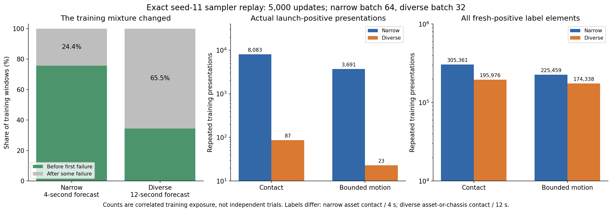
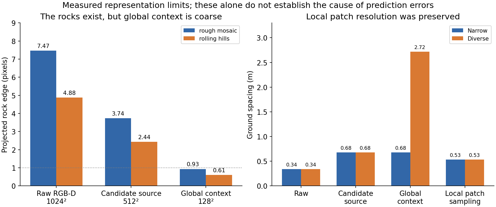

# Perception and training-support investigation

The current failures cannot be explained by the absence of vision or a large measured camera-registration defect. The offending hazards exist in the saved RGB-D, and the relevant near-term terrain is sampled by valid route patches. Training exposure and representation changed substantially, but neither a larger network nor more training has been established as a fix. The separate physical control establishes a sharper failure: the learned score preferred a refined family-6 route that failed over a different safe original candidate, family 12. The refined winner’s own unrefined parent was unsafe.

This is a read-only diagnosis of frozen models, train/validation packs, and already-unsealed protected recordings. No optimizer update, new model forward, cost change, or new vehicle rollout was performed by these diagnostics. Sensor checks queried the existing Chrono terrain. All conclusions below distinguish direct measurements from unresolved explanations.

## The earlier demo was not a clean successful benchmark

The [smooth-hill development report](../../../../docs/vision/hmmwv_traverse/mppi_smooth_hill_revision_20260909.md) already records a rock collision within the 4-second forecast with predicted contact probability 1.14%, a safe straight 6 m/s route rejected at 43.91%, and hill failure outside the forecast (bounded motion at 11.45 s, strict stall at 17.20 s). The showcased scene followed 37 geometry probes. Earlier safe fixed-library selections and selected demonstrations were not a scene-disjoint online success-rate estimate. Therefore, this is a harder task with a changed model and measurement contract, not a measured regression from established narrow-terrain hazard reliability.

| Contract | Narrow focused v2 | Diverse H60 |
|---|---:|---:|
| Train scenes / episodes / windows | 24 / 144 / 1,341 | 24 / 360 / 53,830 |
| Validation scenes / episodes / windows | 8 / 48 / 440 | 6 / 90 / 13,625 |
| Forecast | 20 × 0.2 s = 4 s | 60 × 0.2 s = 12 s |
| Physical traversal scale | Roughly 40 m; selected short demonstrations | Roughly 228 m goal chord on 240 m terrain; 180 s cap |
| Candidate RGB-D source / global encoder input | 128² / 128² | 512² / 128² |
| Local patch | 8 m × 8 m, 16² samples | Same |
| Elevation normalization | 10 m | 40 m |
| Image timing | Current image at sparse anchors | One pre-drive global observation reused causally |
| Contact label | Asset contact, 20 Hz interval | Asset OR chassis force >1 N, solver-rate extrema |
| Additional targets | Older positive shaft-work definition | Positive engine-interface work integral; signed roll/pitch and rollover |
| Parameters | 1,639,036 | 3,052,556 |
| Training updates × batch | 5,000 × 64 | 5,000 × 32 |

## Exact training exposure shifted toward already-failed states

The [exposure audit](exposure_v1/exposure.json) covers every train/validation row. The [sampler replay](replayed_draws_v1/replayed_draws.json) reproduces the exact seed-11 CPU index stream for all 5,000 updates, and its SHA-256 matches each completed training run's saved draw digest. These are actual repeated presentations, not expected counts or independent trials.

Already-failed prefixes occupy **65.51%** of diverse training windows versus **24.38%** of narrow windows. In diverse training, 91.93% of contact-positive final-horizon windows and 93.05% of bounded-motion-positive windows follow some already-observed failure. Fresh positive contexts still span all 24 training scenes: contact 2,155 windows / 186 episodes; bounded motion 2,318 windows / 230 episodes. The dataset therefore contains prospective failure supervision; it is not exclusively post-event supervision.

| Actual presentations during training | Narrow | Diverse |
|---|---:|---:|
| All launch windows | 34,103 | 1,100 |
| Launch windows with contact positive at horizon end | 8,083 | 87 |
| Launch windows with bounded motion positive at horizon end | 3,691 | 23 |
| Batches containing a launch contact positive | 4,004 / 5,000 | 86 / 5,000 |
| Batches containing a launch bounded-motion positive | 2,592 / 5,000 | 23 / 5,000 |
| Fresh pre-failure contact-positive rows | 21,638 | 6,350 |
| Fresh pre-failure bounded-positive rows | 30,857 | 6,742 |
| Fresh contact-positive horizon elements | 305,361 | 195,976 |
| Fresh bounded-positive horizon elements | 225,459 | 174,338 |
| Distinct fresh contact-positive windows sampled | 91 | 2,056 |
| Distinct fresh bounded-positive windows sampled | 130 | 2,202 |

The expected uniform repetition is 238.63 versus 2.97 draws per window, an 80.3× reduction. **This is not an 80× reduction in independent data or every risk signal.** Windows overlap, diverse coverage is broader, and the longer horizon supplies more positive label elements per sampled row. Launch exposure is especially sparse; aggregate fresh positive-element exposure falls much less. The old onset metadata lacks separately stored rollover onset, and its contact definition/horizon differ, so these counts diagnose training allocation rather than equal-difficulty examples.

All diverse target heads have supported labels. Launch rollover has four positive windows and 17 presentations; fresh pre-failure rollover has 49 positive windows and 154 presentations. Risk loss is implemented, including the explicit class-prior correction: `BCE(logits + log(pos_weight), labels, pos_weight=...)`; inference uses raw logits. There is no demonstrated missing sigmoid or missing prior correction. At step 5,000, validation event loss is 0.156919 of total weighted loss 0.236179 (66.4%). This does not measure gradient share, but it contradicts a claim that event loss is simply absent. Contact/bounded positive weights change from 3.366/2.599 to 1.0905/1.0 as the mixture changes; diverse rollover weight is capped at 20.

**Interpretation:** insufficient or poorly allocated prospective-risk updates is a plausible, falsifiable explanation. The current evidence does not prove undertraining, and does not justify an arbitrary 80× longer run.

## Current sensor geometry sees the hazards

The [native terrain audit](sensor_geometry_v2/sensor_geometry.json) evaluates 2,048 unobstructed interior depth pixels per offending scene against frozen Chrono terrain. Assets, vehicle and terrain edges are excluded geometrically, without choosing pixels by residual. Rough-mosaic median / 95th-percentile elevation error is **1.45 / 7.16 mm**; rolling-hills is **2.19 / 6.31 mm**. Maximum errors are below 11.6 mm. Model-image encoding recomputes exactly, arena corners are visible, and valid model elevations are not clipped. This is inconsistent with the large historical OptiX field-of-view defect.

The sparse vehicle roof-marker RGB projection differs by 2.24 / 2.26 raw pixels. Only three / two marker pixels are available, so this is a coarse independent RGB check, not a subpixel proof for every object. Actual offending rock roofs have **52 / 25 depth hits**, with top-elevation errors below 48 / 29 micrometres, and corresponding rock-colored RGB pixels. The stored depth is genuinely measuring these objects.

The rough-mosaic rock edge spans **7.47 raw pixels → 3.74 candidate-source pixels → 0.93 global-context pixels**. The rolling rock spans **4.88 → 2.44 → 0.61 pixels**. Raw sensor resolution and candidate-source physical resolution were preserved by scaling camera height and image size together; local patch sample spacing remains 0.533 m. The global encoder still uses 128² and is **4× coarser physically**, at 2.718 m/pixel. The same elevation contrast is also 4× smaller after the new 40 m depth normalization.

These are measured representation limits. They do not establish that global resolution, CNN architecture or depth scaling caused the incorrect score. The local patch encoder can still receive the near-term hazards, although objects occupy few independent source pixels. See actual [rough-mosaic](patch_geometry_v1/rough_mosaic_rock_resolution.png) and [rolling-hills](patch_geometry_v1/rolling_hills_rock_resolution.png) RGB/depth/source/global comparisons.

## The route patches are valid; timing and state still matter

The [patch audit](patch_geometry_v1/patch_geometry.json) samples the exact causal command features exported by the decision audit, using frozen model projection code. It constructs no learned module or checkpoint forward. All inspected anchors in all four failing selected trials have **zero invalid patch pixels**. Patches are driven by the commanded nominal future route; they are not oracle crops centered on actual future vehicle positions.

At rough-mosaic launch, the eventual rock center is approximately 5.3 m beyond the nearest final patch center, outside the 8 m square's center coverage. However, the earlier **first chassis-contact location is covered**, only 0.324 m from a sampled nominal patch center for the time route and 1.106 m for the energy route. First chassis contact and later asset contact are different events here. By 2 s, the rock center is inside a patch, about 1.65–1.74 m from its center, yet the energy forecast still accepts with contact probability 0.027.

For rough-energy between 0.45 and 0.50 s, the reference station is unchanged, maximum world patch-center change is **0.0000153 m**, and mean absolute normalized pixel change is **8.90×10⁻⁸** (maximum 4.32×10⁻⁵). Thus its abrupt risk-threshold crossing cannot be attributed to a meaningful change in RGB-D content or crop position. State/history and ego-coordinate command inputs change; this comparison alone does not isolate which drives the instability.

For rolling hills at launch, the rock is approximately 60 m beyond the forecast patch centers and the eventual first-contact location approximately 57 m beyond them. Only the coarse global context can show this distant rock initially. At 10 s, the first-contact location is within 0.887 m of a sampled center; at 11.45 s the rock center enters a local patch. Actual contact remains roughly 19 s away because intervening motion slows. A risk rejection then is not proof of correctly predicting an imminent event inside 12 s.

Corrected fixed-axis patch panels: [rough time](patch_panels_v2/diverse_v1_test_rough_mosaic_00_selected_rgbd_time_patches.png), [rough energy](patch_panels_v2/diverse_v1_test_rough_mosaic_00_selected_rgbd_energy_patches.png), [rolling time](patch_panels_v2/diverse_v1_test_rolling_hills_00_selected_rgbd_time_patches.png), [rolling energy](patch_panels_v2/diverse_v1_test_rolling_hills_00_selected_rgbd_energy_patches.png). Earlier panels in `patch_geometry_v1` are retained but some autoscaled around an off-image marker; use the corrected panels.

The independent [native-curve audit](../decision_audit/native_curve_audit.json) finds rough-time tracking error at most 0.0787 m before contact and only about 0.005 m at first contact. Its spline/polyline discrepancy is millimetres. This is a well-tracked route with a wrong risk prediction, not a large route-registration or controller deviation. Rough-energy has a late 0.902 m tracking deviation; rolling trajectories have larger earlier excursions, so those cases also involve dynamics prediction. Do not reinterpret post-contact nominal-versus-actual timing error as pure steering error.

## What is established, and what to test next

The independent [physical candidate audit](../refinement_summary/report.md) provides the strongest causal result: rough-time's exact unrefined family-12 candidate safely reaches the goal in **41.30 s**, whereas the refined family-6 winner collides/blocks and times out at 180 s. Family 12 is a different original candidate, not the winner’s parent; all four selected winners’ unrefined parents were also unsafe. The model prefers the failing refinement, cost **46.475 versus 47.608**, even after final rescoring and risk gating. All four selected replay controls match 241 arrays. This demonstrates exploitation of a learned score error; it does not demonstrate a camera or final-mean gating bypass.

The 12-second risk horizon combined with full-route time/work extrapolation remains a separate planner limitation. It can explain distant hazards at launch, but cannot excuse rough-time's false-safe first chassis contact inside the forecast. RGB-D is informative overall (the existing matched blank/shuffled controls establish this), while specific safety decisions remain unreliable.

A high-leverage next test is a **bounded matched sampling/budget experiment**, rather than an untested architecture replacement: uniform versus explicitly declared prospective-risk-balanced sampling, at the current and one modestly longer update budget, with unchanged model, images, scene split and optimizer settings. Report fresh pre-contact false accepts, safe-route false rejects and launch/early-anchor stability separately from already-failed-tail metrics. Sampling changes alter the objective unless importance correction is applied; declare this explicitly and calibrate only on validation data. Physically validate predeclared original-versus-refined candidate rankings after model selection, with separate same-parent controls to distinguish ranking errors from refinement-induced changes. The current protected test has been opened for diagnosis and must not become a tuning set; use untouched scenes for any subsequent confirmatory claim.

If additional updates improve both samplers, update budget is implicated; if the balanced arm improves prospective risk at matched budget without losing safe controls, exposure allocation is implicated. Neither outcome should be assumed now. A resolution/patch architecture change should be tested separately only after these factors are controlled.

## Reproduction and limits

- `audit_exposure.py`: AMD job 412217, completed; all train/validation rows, no test in exposure counts.
- `audit_replayed_draws.py`: AMD job 412231, completed; exact Torch 2.10.0+ROCm sampler replay, saved draw digests matched.
- `sensor_code_v2/audit_sensor_geometry.py`: AMD job 412229, completed; actual frozen Chrono terrain and existing observations. Earlier 412224 stopped at import before work and is preserved.
- `audit_patches.py`: local CPU Torch 2.12.0 deterministic coordinate/image transforms only; no learned inference. Forecast features are imported from the frozen decision audit.
- `render_summary.py`: reads completed JSON artifacts only.

Raw JSON/source files preserve hashes and input provenance. `patch_geometry.json` has a naming mistake: `actual_future_same_time_center_error_median_m` was computed as a mean, not a median; this report does not use that field. `contact_points.json` stores interval-end poses; event onset times quoted by the decision audit are interval starts, 0.05 s earlier. No simulator truth was supplied to a forecast or candidate-image input by this investigation.
