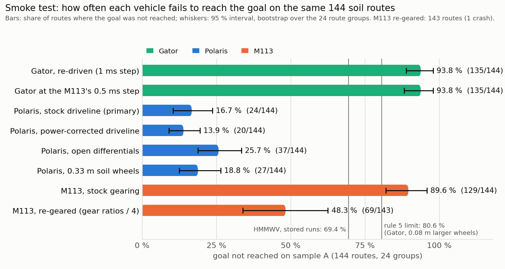
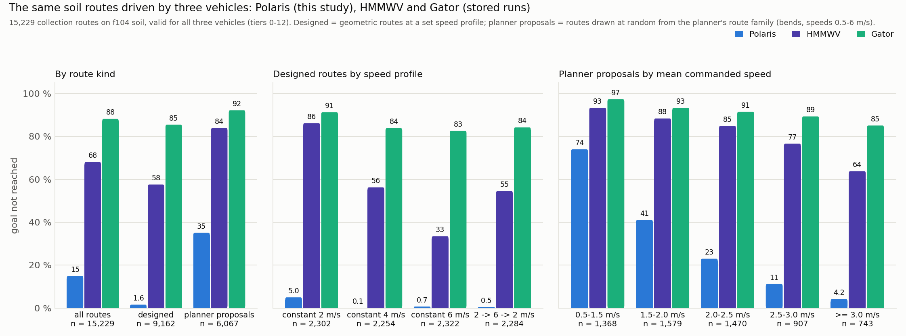
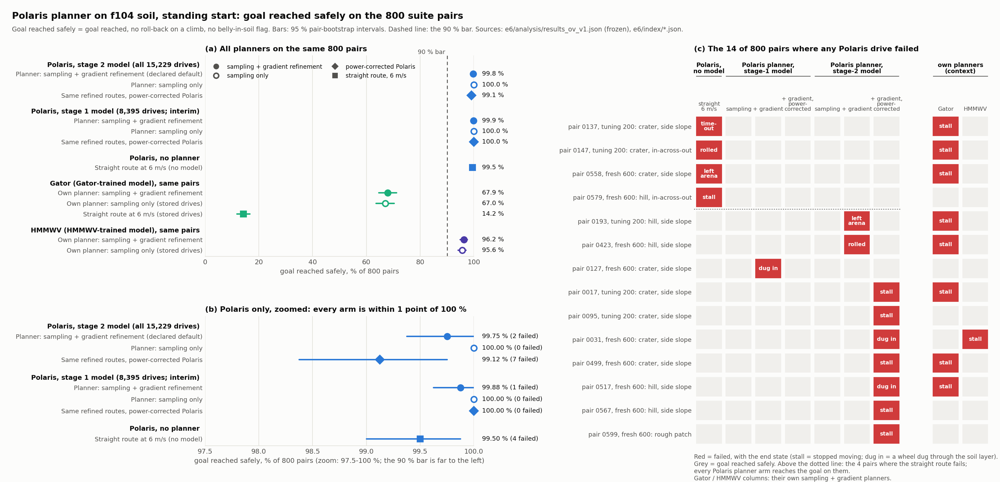
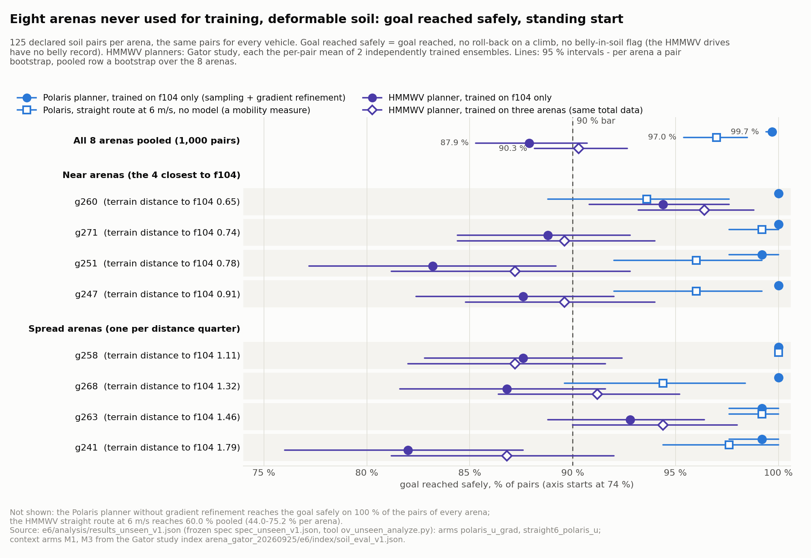
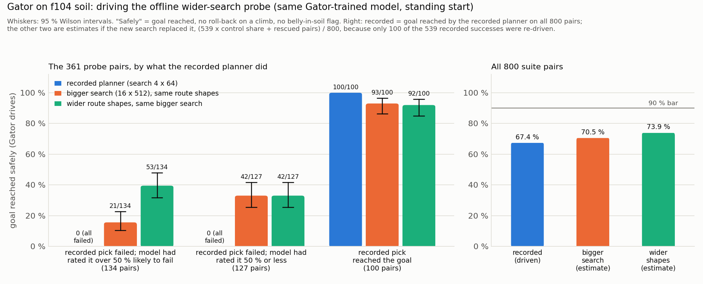

# REPORT: Chrono's Polaris and M113 on deformable soil, and a planner for the Polaris (2026-09-27/28)

**Answer.** Both of your milestones are met for the Polaris, with a wide margin, **on deformable soil**. The planner is trained on the Polaris's own f104 soil drives, plans once from a standing start and refines the route by gradient steps; the Polaris then drives that route. It reaches the goal safely on **99.8 %** of the 800 f104 test pairs (milestone A: the pipeline works for a new vehicle). On **8 arenas it never trained on** it reaches the goal safely on **99.7 %** of 1,000 pairs, and every arena is at 99.2-100 % (milestone B: the planner generalises). Your bar is 90 %. The Polaris is also a very mobile vehicle on this soil. Driving straight to the goal at 6 m/s, with no model, already reaches 99.5 % on f104 and 97.0 % on the unseen arenas. On the unseen arenas the HMMWV reaches 60.0 % on the same straight routes and 87.9-90.6 % with its planners (on f104 its planner reaches 96.2 %). Every Polaris planner number is on deformable soil. **No rigid-ground Polaris data was collected** (by plan: the request was about soil; a rigid collection was offered on 09-28 and not started). In the smoke test the Polaris got through soil far better than the Gator. Chrono's stock M113 did not; an M113 with 4x lower gearing did, but stayed well behind the Polaris. The M113 was only ever planned up to the smoke test, and all Gator and M113 drives had finished when you asked on 09-28 to stop them and focus on the Polaris.

Words used throughout:
- **f104** = the training arena of all earlier soil studies.
- **soil** = Chrono's deformable particle soil (CRM).
- **pair** = one start/goal task.
- **Goal reached safely** = goal reached, no roll-back on a climb, and the underbody did not sit more than 5 cm below the soil surface for over 1 s (the "belly flag"). The HMMWV drives and some stored drives of the earlier studies have no belly record, so for them only the first two apply.
- **Straight route** = the straight line to the goal driven at 6 m/s by the same route follower, with no model.
- **Designed routes** = geometric routes at a set speed profile (constant 2, 4 or 6 m/s, or 2 -> 6 -> 2 m/s). **Planner-style routes** = random routes from the planner's own route family (sideways bends and random speeds between 0.5 and 6 m/s).
- **Launch check** = after a 0.8 s braked settle the vehicle stands upright (roll and pitch within 25 deg), 0-1.2 m above the ground and nearly still (at most 1 m/s). A "launch failure" is a drive that fails this check.
- **Interim planner** = the Polaris planner trained on the first 7 routes (of 12-13) of each start/goal group; **final planner** = trained on all routes. The milestones use the final planner.
- **Risky failures** (Gator) = pairs where the recorded route failed and the model had rated it over 50 % likely to fail.

## Short answer

| question | answer | key numbers (source) |
|---|---|---|
| **Milestone A**: does the whole pipeline (collect, train, plan, drive) work for a new vehicle, the Polaris on f104? | **Yes, met, clearly above the bar** | Goal reached safely on 99.8 % of the 800 pairs [95 %: 99.4, 100.0] and 99.8 % of the 600 fresh pairs. 0 crashes, 0 launch failures, 0 belly flags. Straight route: 99.5 %, so the Polaris has very good mobility on f104 soil; planner vs straight route: no meaningful difference (-0.2 points, 90 % [-0.5, 0.0]), both at the ceiling. (`e6/analysis/results_ov_v1.txt`; `RESULTS_planner.md` 0, 5) |
| **Milestone B**: does the f104-trained Polaris planner work on 8 arenas it never trained on? | **Yes, met, clearly above the bar** | 99.7 % of 1,000 pairs [95 % over arenas: 99.4, 99.9]; every arena 99.2-100 %. Straight route 97.0 % (93.6-100 % per arena); the planner does better than it (-2.7 points of failure [95 %: -4.6, -1.2]). The HMMWV planners on the same pairs: f104 only 87.9 %, three arenas 90.3 %. (`e6/analysis/results_unseen_v1.txt`; `RESULTS_planner.md` Unseen arenas) |
| **Smoke test**: do the Polaris and the M113 get through soil better than the Gator? | **Polaris: far better**, and not because of the known driveline defect. **M113: stock no; with 4x lower gearing yes**, but far behind the Polaris | Goal not reached on the same 144 routes: Polaris 16.7 %, Gator 93.8 %, stock M113 89.6 %. Re-geared M113 48.3 % on 143 routes (1 crash; the Gator 93.7 % on those 143). The power-corrected Polaris driveline does as well (13.9 %). Open differentials are 9 points worse (25.7 %) but still far better than the Gator. (`RESULTS_smoke.md` 0, 1; `analysis/smoke_m113_v1_final.txt`) |
| **Data collected**: soil or rigid, and how much against the HMMWV? | **Soil only.** The Polaris drove all of the HMMWV's f104 soil routes; **no rigid ground** | Soil: 15,235 routes = 100 % of the HMMWV's f104 soil routes; 93.0 vs 91.5 simulated hours; 57,228 vs 58,268 training rows; 99.96 % valid. Rigid: 0 of the HMMWV's 24,000 routes (by plan, PLAN 1.1). Goal not reached on the identical routes: Polaris 15.0 %, HMMWV 68.0 %, Gator 88.1 %. (LOG 16:10; `RESULTS_collection.md` 0, 3) |
| **Gator planner checks**: do gradient refinement or wider route shapes lift the Gator's planner? | **A little; nowhere near 90 %** | Gradient refinement: 68.0 vs 67.4 % goal reached (no meaningful difference). Wider route shapes: rescue 53 of the 134 risky failures (pairs where the recorded route failed and the model had rated it over 50 % likely to fail); estimated 73.9 % of the 800 pairs (about 69-77 % given only 100 re-driven controls) vs the recorded 67.4 %. (`RESULTS_collection.md` 6, 7) |
| **M113 status** | **Only ever planned up to the smoke test**; no collection | The M113 costs 4.1x the Gator per simulated second on the same GPU type (6.2x over the mixed nodes it ran on, the frozen read-out's figure). A full collection would take about 2,600 GPU-hours at the mixed-node rate. All Gator and M113 drives had finished when you asked at 13:53 to stop them and focus on the Polaris; from then on only Polaris work ran. (PLAN 1.3; `RESULTS_smoke.md` 6; LOG 06:00, 13:53) |

## 1. What was done

### 1.1 Vehicles (and what had to change to run them in our loop)

| vehicle | what it is | changes (all declared before any drive) |
|---|---|---|
| **Polaris** | Chrono's Polaris model, based on a 2013 Polaris MRZR: 1,378 kg, all four wheels driven, 0.33 m tyres, limited-slip torque split (a spinning wheel cannot take all the torque) | Reference point moved from the front axle to mid-wheelbase (physics identical by test), so the launch check and the goal rule use the body centre. Spawned 0.40 m above the ground (the frozen collector uses 0.75 m). Soil-contact wheels are 0.25 m cylinders of stock width, calibrated so the settled sinkage matches the HMMWV's. **Stock driveline as shipped, with a known defect** (section 7). Variants: power-corrected driveline (smoke test, plus the 800 refined f104 routes as a check); open-differential driveline and 0.33 m soil wheels (smoke test only). (`RESULTS_smoke.md` 8; `NOTES_M1.md`; PLAN 9.1 item 4) |
| **M113** | Chrono's M113 tracked vehicle: 11,343 kg, 127 track shoes, steering by braking one track, engine with torque converter and automatic gearbox | Brake replaced by a brake that can lock (Chrono's clutch-per-sprocket brake), because the stock brake never locks. Each track shoe meets the soil as one flat pad. 0.5 ms time step (1 ms is unstable). Variant "re-geared": gearing made 4 times lower, so the sprockets get about 4 times the push at a quarter of the speed in each gear (the stock push is at most 0.35 of its weight). (`RESULTS_smoke.md` 8; `NOTES_M2.md`; PLAN 9.1 item 3) |
| **Gator** | The Gator of the Gator study (rear-wheel drive, 14 kW), re-driven through the new vehicle-selection wrapper around the collector | None (144/144 re-drives match the stored runs) |
| **HMMWV** | Stored drives of the earlier soil studies, plus 800 new drives of the HMMWV's own planner with gradient refinement (f104) and 11 reproduction checks (3 repeat drives, 8 unseen-arena reference drives) | None (reference only) |

### 1.2 Soil set-up (unchanged from the earlier soil studies)
- Chrono CRM particle soil: 0.08 m particle spacing, a **0.24 m layer over a rigid floor** that follows the terrain, 1 ms step, fresh soil for every drive (PLAN 1.1).
- The same collector, route follower, stop rules and labels as the Gator and HMMWV studies. Only the vehicle and its own settings (Polaris spawn height, M113 time step and track contact) change.

### 1.3 Protocol
- **Smoke test:** 144 routes (24 start/goal groups) on f104, driven by every vehicle and compared route by route with the Gator driven again in the Polaris launch (PLAN 2).
  - The M113 ran in its own jobs; the frozen tool paired it with that same Gator re-drive. The M113 launch's own Gator (at the M113's 0.5 ms step) also failed 93.8 % and gives the same verdicts (LOG 09:10, correction 3).
  - The tool's multiple-test correction covered 1 comparison for the Polaris and 2 for the M113, not the plan's 3. Both verdicts also pass with 3 (LOG 09:10, correction 4).
  - A second route set, 96 of the f104 test pairs, was driven by the Polaris only: straight route 1.0 % not reached, the HMMWV planner's routes 0 % (LOG 01:26). The M113 was not driven on it.
- **Collection:** the same 15,235 soil routes the Gator and the HMMWV drove on f104 (PLAN 3).
- **Planner:** a risk model (5 small networks) trained on the Polaris's drives. From a standing start, a sampling search (4 rounds of 64 candidate routes) picks the least risky route, and gradient steps then refine it. The route is driven once, with no replanning (PLAN 1.7, 4).
- **Test sets:** the 800-pair f104 suite, whose pairs are never in training (milestone A). The 1,000 declared soil pairs on the 8 unseen arenas of the Gator study, each planned with its own arena map (milestone B).

### 1.4 How the rules were fixed in advance
- The plan was written and hashed before any cluster drive (23:55; `PLAN.md`, `PLAN.sha256`). Amendment 9.2 (13:55) came before any unseen-arena drive. Each amendment was re-hashed.
- Amendment 9.1 (01:10 in the plan, 01:05 in the LOG) came a few minutes **after** the first smoke drives had started (00:56, from the cluster's job accounting), so its heading "before any smoke drive" is not exact. It did come before any smoke result (first verdict 01:26) and before any collection or planner drive.
- The smoke decision rule is a script, frozen and hashed before any smoke drive (`scripts/ov_smoke_analyze.py`, LOG 01:05).
- The milestone A read-out spec was frozen at 00:57, before any drive of those planners (`e6/analysis/spec_ov_v1.json`). The milestone B spec was frozen at 14:03, before any unseen-arena drive (`e6/analysis/spec_unseen_v1.json`).
- Every planner's routes were locked by sha256 before they were driven, and planning again gave identical routes (`RESULTS_planner.md` 2; `NOTES_U1.md` 2).
- Every module was checked by an independent verifier (`VERIFY_M1-M4.md`, `VERIFY_U1.md`), and the plan by a reviewer (`REVIEW_R1.md`: 2 blockers and 9 should-fix points). Amendment 9.1 adopted both blockers and 8 of the should-fix points. The ninth, a set of M113 fairness items, was adopted only in part: recounting the M113's goals from the vehicle centre was declined, because as worded it would count every M113 goal as a failure (PLAN 9.1 item 11).

## 2. Smoke test: Polaris and M113 against the Gator

| vehicle | goal not reached (144 routes) | vs the Gator re-drive (93.8 %) | verdict (frozen rule) |
|---|---|---|---|
| **Polaris, stock driveline** | **16.7 %** | -77.1 points [95 %: -83.3, -70.8]; 111 routes fail only for the Gator, 0 only for the Polaris | **better** |
| Polaris, power-corrected driveline | 13.9 % | -79.9 | (robustness check: passes) |
| Polaris, open differentials | 25.7 % | 9.0 points worse than the stock Polaris [+4.2, +13.9], p 0.0023 | still far better than the Gator |
| Polaris, 0.33 m soil wheels | 18.8 % | 2.1 points worse than the stock Polaris (not significant) | still far better |
| M113, stock gearing | 89.6 % | -4.2 [-11.1, +2.8], p 0.09 | not better |
| **M113, re-geared** | **48.3 %** (143 routes, 1 crash) | -45.5 [-58.0, -33.3] (the Gator 93.7 % on these 143) | **better** |

Source: `RESULTS_smoke.md` 0-2.
- The Polaris reached the goal on all 86 designed routes. All 24 failures are on random planner-style routes, 22 of them with a mean commanded speed of about 2 m/s or less (these routes are much slower than the designed ones: median 1.9 vs 3.9 m/s). It is also far better than the stored HMMWV runs on these routes (69.4 % not reached).
- The stock M113 lacks drive torque (its sprocket push is at most 0.35 of its weight). With 4x lower gearing it is still well behind the Polaris (48.3 vs 16.8 % on the same 143 routes).
- Cost per simulated second: Polaris = Gator (0.99x). The M113 costs 4.1x the Gator on the same GPU type (6.2x over the mixed nodes it ran on, the frozen read-out's figure); a factor of about 2 comes from its 0.5 ms step (`RESULTS_smoke.md` 6; `analysis/smoke_m113_v1_final.txt`).

## 3. Data collection (Polaris, soil only)

| | Polaris | HMMWV (stored) | Gator (stored) | source |
|---|---|---|---|---|
| soil routes on f104 | **15,235** (100 % of the HMMWV's) | 15,235 | 15,235 | `RESULTS_collection.md` 1 |
| **rigid-ground routes** | **0** | 24,000 | 24,000 | LOG 16:10; Gator study REPORT 1 |
| simulated hours (soil) | 93.0 | 91.5 | 141.1 | `RESULTS_collection.md` 4 |
| training rows (soil, all tiers) | 57,228 | 58,268 | 55,826 | LOG 16:10; `RESULTS_collection.md` 5 |
| valid drives | 99.96 % (6 rejected; 0 crashes, 0 launch failures, belly 0.03 %) | | belly 8.5 % | `RESULTS_collection.md` 2 |
| goal not reached, same 15,229 routes | **15.0 %** | 68.0 % | 88.1 % | `RESULTS_collection.md` 3 |

- **No rigid ground, by plan.** The plan declared before any drive: "Soil only; no rigid collection (the user asked about soil)" (PLAN 1.1). A rigid collection was offered on 09-28 and not started.
- It ran from 01:30 to 08:23 (LOG).
- **The Polaris fails mostly when it drives slowly.** Designed routes: 1.6 % not reached. Random planner-style routes: 35.1 %, rising to 74 % at a mean commanded 0.5-1.5 m/s and falling to 4 % at 3 m/s or more (`RESULTS_collection.md` 3).

## 4. Milestone A: the pipeline works for the Polaris on f104 (met)

| on the 800 f104 soil pairs, standing start | goal reached safely | source |
|---|---|---|
| **Final Polaris planner (declared: sampling + gradient refinement)** | **99.8 %** [99.4, 100.0]; 600 fresh pairs 99.8 % | `results_ov_v1.txt` bar line |
| Final Polaris planner, sampling only | 100.0 % | same |
| same refined routes, power-corrected Polaris | 99.1 % [98.4, 99.8] | same |
| Interim Polaris planner (trained on the first 7 routes, of 12-13, of each start/goal group) | 99.9 % | `RESULTS_planner.md` 3 |
| **Polaris, straight route (mobility measure)** | **99.5 %** | same |
| Gator / HMMWV, each with its own planner (sampling + refinement) | 67.9 % / 96.2 % | same |

- **Verdict of the frozen spec:** meets the bar and is clearly above it. For "clearly above", the rule in force uses the one-sided 95 % lower bound over the 9 terrain clusters: 99.24 % (800 pairs) and 99.50 % (600) (`RESULTS_planner.md` 5).
- **Which rule.** The milestone rule (amendment 9.1, fixed before any planner drive) is the 90 % bar plus valid drives. Under the original plan wording the frozen tool also prints "does not beat the straight route": on f104 both are at the ceiling (-0.2 points of failure, 90 % [-0.5, 0.0]; the planner fails 2 pairs the straight route reaches, the straight route 4 the planner reaches), because the Polaris is so mobile. On the unseen arenas the planner beats the straight route (-2.7 points [-4.6, -1.2]; section 5). Gradient refinement vs sampling only: no meaningful difference in either test (`results_ov_v1.txt` CRITERIA and FAMILY lines).
- **Valid:** 0 crashes, 0 launch failures, 0 belly flags.
- **Mobility.** The straight route fails only 4 of the 800 pairs, all slope crossings. Every Polaris planner reaches the goal on those 4, and the declared planner fails 2 other side-slope pairs (`RESULTS_planner.md` 5).
- **Offline check:** the model ranks held-out routes well. Among the routes collected from one start/goal pair, it rates a failing route as riskier than a successful one about 98 % of the time (within-pair AUC 0.977-0.981; 0.5 = chance). Its absolute risk numbers are far too optimistic (predicted 1.4e-5, observed 0.25 %) (`RESULTS_planner.md` 1, 7).

## 5. Milestone B: the planner generalises to arenas it never trained on (met)

| 1,000 soil pairs on 8 unseen arenas, standing start | goal reached safely | per arena | source |
|---|---|---|---|
| **Final Polaris planner, trained on f104 only (declared)** | **99.7 %** [over arenas 99.4, 99.9] | 99.2-100 %; all 8 arenas' 95 % intervals lie above 90 % | `results_unseen_v1.txt` VERDICT |
| Final Polaris planner, sampling only | 100.0 % | 100 % everywhere | same |
| **Polaris, straight route (mobility measure)** | **97.0 %** [95.4, 98.5] | 93.6-100 %; on two arenas (93.6 and 94.4 %) its interval reaches below 90 % | same |
| HMMWV planner, f104 only (sampling only, routes 0-6 data), context | 87.9 % [85.3, 90.7] | 82.0-94.4 % | same, context |
| HMMWV planner, three arenas (sampling only, routes 0-6 data), context | 90.3 % [88.2, 92.7] | 86.8-96.4 % | same, context |
| HMMWV, straight route (context) | 60.0 % | 44.0-75.2 % | same, context |

- **Valid:** 1,000/1,000 drives per arm; 0 crashes, 0 launch failures, 0 belly flags for the planner (1 for the straight route, a rollover).
- **No sign of a drop on the arenas least like f104** (99.8 % near, 99.6 % spread).
- **Where it failed:** 3 pairs, all side slopes, all on routes the gradient refinement had changed. The sampling-only route and the straight route reach the goal on all three.
- **Mobility.** The straight route fails 30 pairs: 24 crater and 6 hill crossings, 8 of them on one arena (5 dug in) and 7 on another (3 rolled over). The planner reaches the goal on 30 pairs the straight route fails, and fails 3 it reaches; the frozen test calls this an improvement (-2.7 points [-4.6, -1.2]).
- **Against the HMMWV (context, not a test).** The Polaris planner has about 9-11 points fewer failures than each single HMMWV planner ensemble on the same pairs. Against the first of the HMMWV's two f104-only ensembles (88.4 %) it is -11.3 points: 2 pairs fail only for the Polaris, 115 only for the HMMWV. Against the two-ensemble mean of 87.9 % shown in the table the gap is 11.8 points. This compares vehicles more than planners, and it is not like for like:
  - the HMMWV planners were fitted on routes 0-6 only: 29,210 rows for the f104-only model vs 52,021 for the Polaris, about half the data;
  - they use the sampling search only, with no gradient step;
  - the HMMWV drives have no belly record, so "safely" means only "not unsafe" for them;
  - the Polaris model has a limited-slip torque split, while the HMMWV has open differentials. In the smoke test the Polaris with open differentials failed 25.7 %, still far below the HMMWV's 69.4 %.
- Per-arena table, tests and failure details: `RESULTS_planner.md`, section "Unseen arenas".

## 6. The Gator and the M113 (context)

On 09-28 at 13:53 you wrote "stop gator, M113 for now, just focus on achieving milestones for polaris". By then every Gator and M113 drive had finished (LOG 13:53: no Gator or M113 rows left in the queue), so nothing was cut short; from then on only Polaris work ran. The M113 was only ever planned up to the smoke test (PLAN 1.3). What was learned:

**Gator planner checks** (Gator-trained model, 800 f104 pairs, standing start; `RESULTS_collection.md` 6).

- **Gradient refinement:** 68.0 vs 67.4 % goal reached, no meaningful difference. For the HMMWV: 96.2 vs 95.6 %, inconclusive.
- **Wider route shapes** (up to 20 m sideways, bigger search), driven on 361 pairs:
  - they rescue 53 of the 134 risky failures (the bigger search alone: 21);
  - estimated 800-pair rate 73.9 % (about 69-77 % given only 100 re-driven controls) vs the recorded 67.4 %, which counts goal reached, not goal reached safely.
- Half of the Gator's recorded failures (127 of 261) were on routes its model had rated safe (50 % or less likely to fail). The new searches rescued a third of those too (42 of 127). But the model's safe ratings were often wrong there: 108 wider-search routes were rated below 1 % risk and only 41 reached the goal. So the Gator needs a better model (or a stronger vehicle) as well as a better search.

**M113** (`RESULTS_smoke.md`):
- Chrono's stock M113 is no better than the Gator on soil (89.6 vs 93.8 % not reached).
- An M113 with 4x lower gearing is clearly better (48.3 %) but well behind the Polaris. The verdict applies to that re-geared M113, not to Chrono's stock M113.
- The M113 costs 4.1x the Gator per simulated second on the same GPU type (6.2x over the mixed nodes it ran on, the frozen read-out's figure). A factor of about 2 comes from its 0.5 ms step. A full collection would take about 2,600 GPU-hours at the mixed-node rate, so it was out of scope from the start.
- Its soil model has several stand-ins (section 7).

## 7. Caveats

- **Stock Polaris driveline defect.** Chrono's simple driveline as shipped gives the wheels about 16 times the engine's power, and the gearbox stays in first. Below about 6 m/s it acts like a one-gear 4WD vehicle with a plausible wheel torque (about 2.8 kN m). All training data use it. The power-corrected check agrees:
  - smoke test 13.9 vs 16.7 % not reached;
  - on the milestone A routes 99.1 % (7 vs 2 pairs fail only with it, p 0.18);
  - it was not driven on the unseen arenas, and never used for training.

  Sources: `RESULTS_smoke.md` 1, 8; `RESULTS_planner.md` 6.
- **Stand-in soil wheels.** Each wheel meets the soil as a 0.25 m cylinder, calibrated to the HMMWV's sinkage. At 0.08 m particle spacing the soil sees a narrow tyre as wider, which favours the Polaris most. With 0.33 m cylinders the Polaris fails 2.1 points more (not significant: 95 % [-3.5, +7.6], p 0.55; smoke test only) (`RESULTS_smoke.md` 2, 8).
- **Body not coupled to the soil** (every vehicle). The chassis passes through soil without resistance. The belly flag guards against this: Polaris 0.03 % of the collection and 0 in the planner's drives (1 each in the power-corrected check on f104, pair 0499, and the unseen-arena straight route, a rollover); Gator 8.5 % (`RESULTS_collection.md` 2; `results_ov_v1.txt` validity lines; `RESULTS_planner.md` U4).
- **Thin soil over a rigid floor.** 0.24 m of soil (4 particle layers) sits on a floor that carries most of the weight. This likely caps sinkage and favours lighter vehicles over the HMMWV, and hides the M113's low ground pressure (scout reasoning, not measured; `scout/S5_chrono_offroad.md` 0; `RESULTS_smoke.md` 8). It cannot explain the Polaris-Gator gap, because the Gator (906 kg) is lighter than the Polaris (1,378 kg). Deeper or looser soil may challenge the Polaris much more.
- **M113 model.** Four points (`RESULTS_smoke.md` 4, 8):
  - the brake was replaced (the stock brake never locks);
  - track shoes are flat, uncalibrated pads with no grousers;
  - 0.5 ms step;
  - the reference point is the front sprocket, so goals count about 2 m early.

  Also:
  - its soil breakthrough stop (the rule that ends a drive when a wheel or track digs through the whole soil layer) fired 15 times, though the plan expected it to be inactive;
  - the M113 was not driven on the second route set (96 of the f104 test pairs), which confirmed the Polaris verdict;
  - its "better" verdict was never re-checked with goals counted from the vehicle centre (the reviewer's request, declined in PLAN 9.1 item 11);
  - the verdict applies to "an M113 with 4x lower gearing", not to Chrono's stock M113.
- **One terrain generator.** The 8 unseen arenas are new seeds of the generator that made f104. "Never trained on" means new terrain of the same family, and every declared pair is a hill or crater crossing (`RESULTS_planner.md` U8).
- **Single model ensembles.** Each Polaris planner is one trained ensemble of 5 networks. Two HMMWV ensembles trained the same way differ by 1.0 point on the unseen pairs, far less than the Polaris's margin above 90 % (`results_unseen_v1.txt` context).
- **Not like-for-like comparisons.** The HMMWV and Gator numbers are other vehicles, some from stored drives. The stored drives reproduced 144/144, 223/223 and 8/8 end states when re-driven (`RESULTS_collection.md` 6.1; `NOTES_U1.md` 5). On the unseen arenas the HMMWV planners had about half the Polaris's training data (routes 0-6 only: 29,210 vs 52,021 rows), no gradient step and no belly record, and the HMMWV has open differentials where the Polaris model has a limited-slip split (the open-differential Polaris still fails far less than the HMMWV in the smoke test: 25.7 vs 69.4 %) (`RESULTS_planner.md` U7; `RESULTS_collection.md` 7).
- **Standing start, one plan, whole-arena map.** No replanning and no sensing limits.

## 8. Timeline (CDT)

| time | event (LOG) |
|---|---|
| 09-27 22:37 | study started |
| 23:42-00:53 | scouts, plan, four modules built and independently verified |
| 00:56-01:05 | smoke drives launched (Polaris, M113); first drives started 00:56 |
| 00:57 | milestone A read-out spec frozen |
| 01:05-01:10 | amendment 9.1 (after the first smoke drives had started, before any smoke result) |
| 01:26 | Polaris smoke verdict: better (final at 04:40: better, robust) |
| 01:30 | Polaris collection launched |
| 04:30 | M113 smoke relaunched after the 4 h job cap; verdicts at 06:00 / 06:51 |
| 05:47 / 06:06 | routes 0-6 of the Polaris data done / interim planner trained |
| 07:05 | Gator wider-search drives read out |
| 08:23 | all 15,235 Polaris routes done |
| 08:25 | interim planner: 99.9 % on f104 |
| 08:48 | final planner trained |
| 09:09-09:34 | final planner's sampling-only drives |
| **09:15-13:40** | **the session sat idle**; the cluster queue was empty from 09:34 |
| **09:26-13:45** | **the final planner's gradient refinement hung on one pair** (684/800) while another session's jobs shared the local GPU (alone the pair plans in 4 s); killed and re-run with a timeout |
| 13:53 | you: stop the Gator and M113, focus on the Polaris milestones (amendment 9.2); no Gator or M113 drives were left |
| 14:03 | unseen-arena read-out spec frozen |
| 14:20 | final refined routes locked and launched |
| 15:15 | **milestone A met** |
| 15:21 | unseen-arena drives launched (pilot 15:01) |
| 15:45 | you: the straight route measures mobility; which terrain? (answer: all soil) |
| 16:10 | **milestone B met** |

The hang, together with the idle session that did not notice it, delayed milestone A by about 4.3 hours. Why it hung is not known; it happened while another session's jobs shared the local GPU.

## 9. Cost (billed node-hours since 09-27 22:00)

`python3 scripts/ov_bf_billed.py --since 2026-09-27T22:00:00` (run 09-28 16:06): **57.05 billed node-hours**, of which **this study 53.77**. Another session of yours used 3.28 (its jobs start with `rg_`). Soft cap 150, hard cap 180 (PLAN 5).

| purpose | billed node-hours | how counted |
|---|---|---|
| module checks and flat-soil driveability | 0.05 | own jobs |
| smoke test, Polaris (916 drives) | about 1.9 | share of shared jobs |
| smoke test, M113 (432 drives, 2 launches) | 6.4 | own jobs |
| **Polaris soil collection (15,091 new drives)** | **about 30.3** | share of shared jobs |
| Gator / HMMWV gradient-refinement check (1,600 drives) | about 3.0 | share of shared jobs |
| Gator wider-search drives (722) | about 1.7 | share of shared jobs |
| Polaris f104 drives with the interim planner (2,435, incl. 704 straight-route drives and the 800-drive power-corrected check) | about 3.1 | share of shared jobs |
| Polaris f104 drives with the final planner (2,122, incl. the 800-drive power-corrected check) | 3.8 | own jobs |
| training (2 jobs, 9.5 and 16.8 min) | 0.05 | own jobs |
| unseen arenas (16 pilot + 2,610 drives; 2,626 in total, 2,618 of them Polaris) | 3.4 | own jobs |
| **this study, total** | **53.77** | |

How the table was made:
- Job list from `sacct` (the cluster's job accounting; read-only), with the weights of `ov_bf_billed.py`.
- From 00:56 to 08:20 the shared jobs drove the smoke, collection, check and evaluation rows from one queue. Their 40.06 node-hours were split in proportion to each group's episode wall time, from the run records (`analysis/k4_extract.jsonl`, `e6/sync/runs/*/outcome.json`).
- The split was computed for this report and is not stored.
- Against the plan's estimates (PLAN 5): smoke 3-8 (actual 8.3), collection 30-50 (30.3), evaluation 10-15 (15.0), training under 2 (0.05).

## 10. What could come next (suggestions only; nothing started)

- **A rigid-ground Polaris collection** (the HMMWV's 24,000 f104 routes). All Polaris results so far are soil only. This was offered on 09-28 and not started.
- **Terrain where the Polaris is challenged.** Steeper or rougher arenas, or deeper and looser soil than the 0.24 m layer over a rigid floor. On f104 the straight route is at 99.5 %, so a planner cannot show a gain there. On the unseen arenas the planner does better than the straight route (it reaches the goal on 30 pairs the straight route fails, and fails 3 it reaches). But with both above 97 %, harder terrain is needed to compare planners.
- **A multi-arena Polaris dataset** (the Gator study's three training arenas), if a harder test shows a gap.
- **A reduced M113 collection** (for example the first route of every start/goal group, about 1,200 drives), with the re-geared model and a checked track-soil contact, if the tracked vehicle is still of interest.
- **A better Gator model**: on the recorded failures its model had rated safe, even the wider-search routes it rated below 1 % risk mostly failed (41 of 108 reached the goal).

## 11. Artefact map (all under `artifacts/traverse/offroad_vehicles_20260927/`)

| what | where |
|---|---|
| plan (with amendments 9.1, 9.2), hash, log | `PLAN.md`, `PLAN.sha256`, `LOG.md` |
| results: smoke, collection, planner (incl. unseen arenas) | `RESULTS_smoke.md`, `RESULTS_collection.md`, `RESULTS_planner.md` |
| figures | `figures/fig_smoke.png`, `fig_vehicles.png`, `fig_planner_f104.png`, `fig_unseen.png`, `fig_probe.png`. `fig_unseen.png` was drawn by an inline script that was not saved, so it cannot be regenerated from saved code. Its source line uses internal arm names: `polaris_u_grad` = the final Polaris planner, `straight6_polaris_u` = the Polaris straight route, `M1` / `M3` = the HMMWV planners trained on f104 only / on three arenas |
| frozen specs and read-outs | `e6/analysis/spec_ov_v1.json`, `results_ov_v1.{txt,json}`, `spec_unseen_v1.json` (+ `.sha256`), `results_unseen_v1.{txt,json}`, `spec_probe_v1.json` |
| per-drive indexes | `e6/index/soil_eval_ov_final.json`, `soil_eval_polaris_s1.json`, `unseen_polaris_v1.json`, `soil_eval_gradref_v1.json`, `soil_eval_probe_v1.json` |
| smoke analysis and per-route table | `analysis/smoke_*_final.{txt,json}`, `analysis/k4_extract.jsonl`, `analysis/scripts/` |
| planner picks and locks | `e6/picks/f104/`, `e6/picks/<arena>/`, `e6/picks/LOCK_*.sha256` |
| trained Polaris models | `e5/deploy/polaris_s1_soil/` (interim), `e5/deploy/polaris_full_soil/` (final) (with `SHA256SUMS`) |
| task files | `tasks/` (smoke; collection task files `soil_v1`-`v7_polaris.json`, each version containing all earlier rows; these are git-ignored, local only), `e6/tasks/` |
| module notes, verifications, review, scouts | `NOTES_M1-M4.md`, `NOTES_U1.md`, `VERIFY_M1-M4.md`, `VERIFY_U1.md`, `REVIEW_R1.md`, `scout/` |
| tooling (new scripts, prefix `ov_`) | `scripts/ov_*.py`, `scripts/ov_*.sh` (e.g. `ov_vehicle.py`, `ov_m113.py`, `ov_smoke_analyze.py`, `ov_analyze.py`, `ov_unseen_analyze.py`, `ov_bf_billed.py`) |
| cluster root (runs, datasets) | `/work1/dannegrut/harry/experiments/offroad_vehicles_20260927` (`soil_v1/runs`, `e4/`, `e5/`) |