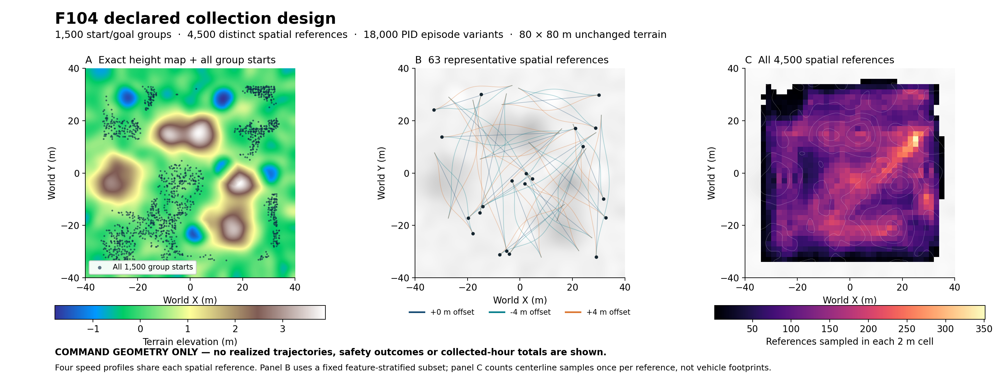

# F104: 50 recorded hours of Chrono traversal

This campaign prepares a richer reference-conditioned FDM dataset on the user's exact F104 terrain. The goal is **at least 180,000 seconds of validated, recorded traversal**, across training, validation and test splits combined. Training seconds must also be reported separately. Settling, failed/partial processes, pilot runs, repeated windows and excluded production attempts do not count.

**Current status:** the terrain, static RGB-D map, 18,000 candidate episodes and collector checks are verified. **`production_v2` has been submitted** with disjoint static task partitions and per-node ledgers, using the same validated collector and runtime. Its seven submission records cover 46 node instances; submission does not imply simultaneous execution or completed data. No audited production-hour total or completed 50-hour claim is made here. The coordinator will add final measured totals. [Replacement contract](../../../artifacts/traverse/fdm_f104_50h_20260909/production_v2/contract.json) and [submission records](../../../artifacts/traverse/fdm_f104_50h_20260909/production_v2/submission.json).

| AMD job / array | Partition | Node instances | Workers per node |
|---|---|---:|---:|
| 412450, tasks 0–4 | mi2104x | 5 | 128 |
| 412451 | mi3258x | 1 | 256 |
| 412454 | mi3008x | 1 | 192 |
| 412455 | mi3508x | 1 | 256 |
| 412456, tasks 0–23 | mi2101x | 24 | 16 |
| 412480, tasks 0–6 | mi3001x | 7 | 16 |
| 412481, tasks 0–6 | mi3501x | 7 | 24 |

The first production queue lost exclusive task ownership across nodes and shared state became inconsistent. The [incident audit](../../../artifacts/traverse/fdm_f104_50h_20260909/production_v1_incident_audit/report.md) found duplicate-output and queue-state errors; it did not isolate the filesystem's locking semantics. **All `production_v1` outputs are preserved and excluded**, including completed episodes. Its [initial submissions](../../../artifacts/traverse/fdm_f104_50h_20260909/launch/submission_v1.json) and [contract](../../../artifacts/traverse/fdm_f104_50h_20260909/launch/contract.json) remain provenance, not production credit.

## Terrain, starts and commands

This overview shows **declared geometry**, not completed vehicle trajectories. It includes all 1,500 start/goal groups; the path panel shows a fixed representative subset, and the density panel includes all 4,500 distinct spatial references. Four speed profiles per reference yield 18,000 episode variants. [PDF](../../../artifacts/traverse/fdm_f104_50h_20260909/design/declared_geometry_overview.pdf) · [Figure selection and hashes](../../../artifacts/traverse/fdm_f104_50h_20260909/design/declared_geometry_overview.json).

| Item | Frozen design |
|---|---|
| Original terrain | `/home/harry/NeDM-mppi-claude/assets/traverse/arena_f104/arena_000.bmp` |
| Isolated exact copy | `assets/traverse/arena_f104_50h_v1/arena_000.bmp` |
| Geometry | 80 × 80 m, 512² pixels, height range −1.8 to 3.9 m |
| BMP SHA-256 | `5d5bc683b6a8d9e99fd323c4112752e0cad214b986319ea1b2396631104ee8ed` |
| Initial inventory | 500 start/goal groups × 12 references = 6,000 episodes |
| Reserve inventory | Groups 0500–1499: 12,000 additional episodes |
| Paired references | Offsets 0/−4/+4 m, each with constant 2/4/6 m/s or smooth spatial 2→6→2 m/s speed profile |
| Physics/controller | HMMWV Full, rigid heightfield, TMeasy tires, unchanged native Chrono PID path follower |
| Timing | 0.002 s vehicle solver, 0.001 s tire step, 0.05 s recording, 0.8 s excluded settling, at most 120 s per episode |

The BMP is copied byte-for-byte; no procedural rocks, trees, houses or terrain modifications are added. Starts cover the arena and all eight heading bins. A 6 × 3 m initial footprint passes geometry gates: fitted grade ≤6°, maximum sampled grade ≤12°, height range ≤0.65 m and plane residual ≤0.20 m. These are gently sloped candidate starts, with native-height and measured settled-state validation required before recording. Geometry eligibility is not a physical safety label.

The [raster audit](../../../artifacts/traverse/fdm_f104_50h_20260909/design/raster_feature_audit.json) checks actual heights around both raw and transformed metadata coordinates. The generator correctly uses the transformed world coordinates for five hills and five craters. Central approaches, exits, flanking cross-slopes and general traversals are included. The reserve adds a targeted approach to the difficult boundary crater; all ten features have commanded-reference coverage. This does not establish actual vehicle visitation or recovery. [Design and integrity](../../../artifacts/traverse/fdm_f104_50h_20260909/design/README.md), [initial cases](../../../artifacts/traverse/fdm_f104_50h_20260909/cases/cases.json), [reserve cases](../../../artifacts/traverse/fdm_f104_50h_20260909/cases_reserve_v1/cases.json).

All twelve siblings stay in one deterministic start/goal split. The nominal 90/5/5 allocation gives **16,104 training, 1,020 validation and 876 test episodes** in the full inventory. All splits use the same BMP: this intentionally tests learning on one arena and transfer to different starts/commands, not unseen-terrain generalization. There is no outcome-based case selection.

The full inventory has 600 hours of maximum capacity, but reference lengths and early endings make that an upper bound. The initial 6,000 prescribed-speed paths alone total approximately 24.98 idealized hours, before vehicle acceleration, terrain or blockage. Therefore, the global counter must use actual episode durations and draw reserve tasks as necessary. Unused reserves need not run.

## Failure and recovery retention

The collector retains the original controls rather than injecting a scripted reverse/escape maneuver. It does not stop merely on contact. Goal arrival, rollover, leaving the actual ±40 m terrain boundary and the 120 s cap remain distinct termination reasons.

For prolonged blockage, a qualifying two-second window must have XY diameter ≤0.25 m, throttle >0.3 throughout, and no deliberate parking. Truncation cannot start before 24 s. The condition then needs two further seconds of confirmation and an eight-second recovery tail; **the earliest possible stop is 34 s**. Any later window that ceases to qualify cancels the pending stop. Actual endpoints and intervals are retained without fabricated padding. These rules preserve attempts and possible reacceleration; they do not certify successful recovery.

The [wrapper pilot](../../../artifacts/traverse/fdm_f104_50h_20260909/wrapper_pilot_v2/report.md), AMD job **412401**, completed eight tests with 220.05 measured task seconds, excluded from production quota. Six replays matched 240 arrays each against their controls. The enabled/disabled 60 s blockage controls matched physically and correctly cancelled a pending stop when displacement exceeded the bound. An earlier wrapper attempt, job 412398, failed before settling because the read-only height check queried unbound collision geometry; it is preserved and excluded.

The pilot did not exercise final native blockage termination, but the preserved canceled cohort subsequently did: `f104_v1_group_0907_route_04` ended after **680 measured intervals, exactly 34.0 s**. Confirmation started at 24 s and the recovery tail at 26 s. All 201 checked two-second windows remained effortful, nonparking and bounded (maximum XY diameter 0.06466 m); all 17 artifact hashes and rich solver/post-step checks passed. This closes the native-stop coverage gap while adding **zero seconds** to the production quota. All 909 recorded native-height and settled-start checks in that incident audit also passed.

## Measurements and their limits

Each completed episode retains the initial anchor, actual state/pose/actions and endpoint, commanded reference/speed, event records, `rich_telemetry.npz` with N+1 samples and `rich_intervals.npz` with N intervals. Rich fields include engine/transmission/driveline torque and speed, signed/positive/negative mechanical work, native wheel slip and tire forces, wheel motion, roll/pitch and rates, suspension spring/shock signals, and chassis/asset contact resultants. Solver-step power integration and post-step attitude/contact extrema retain coverage counts and validity metadata.

Energy means **mechanical work**, primarily engine output torque × transmission motorshaft feedback speed integrated over actual steps. It is not measured fuel consumption. Engine-rotor and driveshaft work remain separate channels. Added terrain normals are geometric normals below wheel hubs; tire-force projections onto them are derived quantities, not internal tire contact-patch loads. Rigid terrain with TMeasy demonstrates tire/vehicle dynamics, **not deformable-soil sinkage or constitutive soil terramechanics**. See the [telemetry schema](fdm_rich_telemetry_schema_20260909.md).

Legacy outcome contact flags are asset-only. Future physical contact labels must use the union of rich chassis and asset resultants, with the declared threshold and interval alignment. Missing optional getters remain missing with metadata. Count an episode only after validating its `episode_complete.json` hashes and actual interval duration; preserve failures separately.

## Static RGB-D and deferred joining

AMD job **412395** captured one vehicle-free terrain map. The [independent map audit](../../../artifacts/traverse/fdm_f104_50h_20260909/static_map_audit_v1/report.md) verified all 4,096 saved native terrain samples, correct orientation, exact RGB/depth outer-boundary agreement and exact saved image encoding. Measured ray-range p95 error is 8.83 mm; reconstructed-height p95 is 8.56 mm. No sensor or physics rerun was needed for that audit.

The map uses **1024² raw RGB-D, 512² model input, 110 m camera height, 47° FOV and 10 m elevation scale**. The deferred packer/model must use these parameters for projection; the previous diverse model's 400 m / 40 m defaults are incompatible. Legacy headless `collection_meta` camera fields are not this image source.

Join the unchanged map by exact image/BMP/metadata/camera/material/runtime identities, with **each episode's own measured anchor, goal and reference**. For later training windows, use that episode's causal state/history/pose prefix. Native-height audit arrays and authored feature geometry remain outside model inputs. Headless production need not wait for per-episode images. FDM has **not been retrained on this collection yet**.

## Isolation, provenance and prior results

Both `/home/harry/NeDM` and `/home/harry/NeDM-mppi-claude` remain read only. New code and local artifacts live in `/home/harry/NeDM-traverse_mppi` on `traverse_mppi`. AMD artifacts live under `/work1/dannegrut/harry/experiments/fdm_f104_50h_20260909`; `pilot_source_v1`, its runtime fingerprint, `static_map_v1` and the excluded production source/results are preserved. Replacement output is `production_v2`, with its frozen static-shard contract; collector source remains `source_v1`, manifest SHA `e55eace6ebeb989682bf4b806f1a45e7fa7cf1ca0427836778f1d9d5d3998e9f`. The unchanged task manifest is reused by hash without reusing v1 episode credit. Physics runs on AMD; any later training also belongs on AMD.

The generator is [generate_traverse_f104_collection.py](../../../scripts/generate_traverse_f104_collection.py); the validated adapter is [collect_traverse_f104.py](../../../scripts/collect_traverse_f104.py). [Handoff hashes](../../../artifacts/traverse/fdm_f104_50h_20260909/design/handoff_manifest.json) and [reserve prefix proof](../../../artifacts/traverse/fdm_f104_50h_20260909/design/reserve_integrity_v1.json) bind the prepared inputs.

This collection follows the [broader-terrain results](fdm_diverse_results_20260909.md) and [failure investigation](fdm_failure_investigation_20260909.md), which found partial transfer but unreliable safety predictions and an avoidable learned ranking error. The [near-assets 12 s diagnostic](../../../artifacts/traverse/fdm_near_assets_h12_20260909/protocol.md) is a separate frozen-model test, not F104 training evidence. More collected data is an experiment toward improving those limitations; it is not yet a demonstrated fix or a completed time/risk/energy planning milestone.
