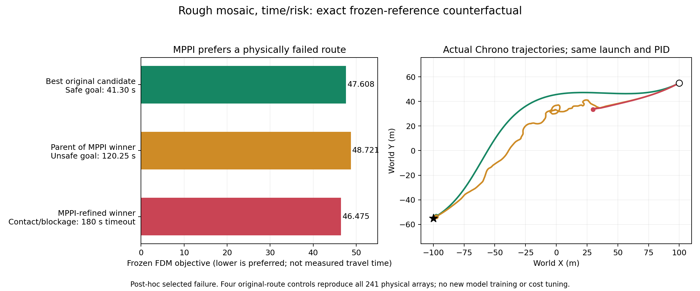

# Why FDM / MPPI accepts unsafe routes

The investigation confirms three separate mechanisms: the initial forecast cannot assess hazards beyond 12 seconds, the model sometimes misses hazards inside those 12 seconds, and MPPI can exploit a prediction error to promote a physically worse reference. Online replanning helps some scenes and harms others; a matched checkpoint does not show a uniform success-rate drop.

This is a post-hoc investigation of already opened data. It adds 24 matched online trials and nine controlled reference executions on AMD, with no training or model/cost changes. Original protected results and the main checkout remain unchanged. The [investigation protocol](../../../artifacts/traverse/fdm_failure_investigation_20260909/protocol.md) separates measured evidence from hypotheses.

## What “safe” means in the current planner

`measured RGB-D + current history + proposed reference → 12 s FDM forecast → predicted-risk gates and time/work cost → MPPI choice → native PID`

An accepted reference has predicted contact probability at most 0.35, bounded-motion probability at most 0.50, and passes the other predicted rollover/attitude and geometric limits. These are operating thresholds, not demonstrated safety guarantees. Bounded-motion outputs before two seconds are ineligible; predicted post-goal parking is excluded. All required event heads are present.

The risk assessment ends at the learned horizon. Remaining time and work are extrapolated from predicted progress/work per meter, but no corresponding learned whole-route safety assessment covers the rest of the roughly 240 m reference. A low predicted initial risk therefore does not imply a safe complete route.

Source inspection confirms the final MPPI weighted mean is rescored and rejected if its cost is nonfinite. The failures are not an unchecked-average bypass. Kinematic validation checks steering, speed and arena bounds; it has no authored obstacle clearance input. See [the frozen-scorer audit](../../../artifacts/traverse/fdm_failure_investigation_20260909/decision_audit/report.md).

## Direct physical evidence of a harmful ranking change

For the rough-mosaic time/risk trial, the exact original best candidate and the selected refinement were executed from the same launch state, with the same vehicle, controller and frozen scene:

| Candidate | Frozen model objective, lower is preferred | Actual Chrono result |
|---|---:|---|
| Best original candidate, family 12, −44 m / 6 m/s | 47.608 | Safe goal in **41.30 s** |
| Parent of the eventual winner, family 6, −22 m / 6 m/s | 48.721 | Contact and blockage; eventual unsafe goal at 120.25 s |
| MPPI refinement of family 6 | **46.475** | Contact during 11.70–11.75 s, blockage, **180 s timeout** |

These objective values are weighted model costs, not measured travel times. MPPI lowers the predicted cost of the initially inferior family enough to make it win. Its prediction is wrong about the physical consequences. This is a demonstrated avoidable ranking failure in this case, not just an association between a route perturbation and a bad outcome.

The four selected-reference replay controls reproduce all 241 stored physical arrays exactly. The four selected parent references are already unsafe; their local changes are therefore not necessary for every failure. In rough mosaic, refinement worsens eventual unsafe arrival into a timeout. In rolling hills, parent and refined references both contact and block. The intervention changes reference geometry and speed together, not geometry alone.

The additional best original reference is the argmin of the original launch scores, not a route chosen from new physical outcomes. However, these scenes were selected from known failures, so this does not establish a general success rate for disabling MPPI. [All nine physical interventions and checks](../../../artifacts/traverse/fdm_failure_investigation_20260909/refinement_summary/report.md).

## Horizon failure and in-horizon prediction failure are different

Contact times in the following table identify the start of the first positive 50 ms contact interval, not an exact contact instant. This interval convention does not change whether the hazard is inside the 12 s forecast.

| Frozen trial | Launch contact probability | Measured first contact | Interpretation |
|---|---:|---:|---|
| Rolling hills, time/risk | 12.7% | 29.70 s | Contact is well beyond the initial 12 s forecast. |
| Rolling hills, energy-aware | 12.8% | 30.45 s | Same long-route coverage problem. |
| Rough mosaic, time/risk | **11.6%** | **11.70 s** | A genuine false acceptance inside the forecast horizon. |
| Rough mosaic, energy-aware | 12.9% | 12.50 s | Initially just outside the horizon; at 2 s it is inside, but the model still accepts with about 2.7% contact risk. |

The rolling-hills vehicle is eventually blocked against an obstacle; rough mosaic has early chassis contact and subsequent asset contact/blockage. Neither selected plan-once failure is a planner-requested pause or rollover.

Reevaluating the unchanged reference from later measured states often raises a warning. Plan-once does not use these later judgments. The first audited rolling-hills rejection, around 11.45 s, is actually premature relative to its measured next-12-second event labels; later rejections also occur with contact inside the horizon. Rough-energy has a transient early rejection, accepts again at 2 s and rejects later. These are not monotonic, reliably calibrated warnings, and they do not prove that simply stopping on the first alarm solves traversal.

The decision audit covers 144 selected causal anchors across four failures and two successful cross-slope controls. It is not an exhaustive alarm scan. Future outcomes choose diagnostic anchor times and labels but never enter model inputs. Saved launch-score replay discrepancies are at most 0.000022; all 86 archived source files are verified. [Risk timelines](../../../artifacts/traverse/fdm_failure_investigation_20260909/decision_audit/causal_risk.png).

## Controller tracking and sensor checks

Rough-time remains within 7.9 cm of the exact native tracking spline before contact, and only about 5 mm from it at contact. The native spline differs from the proposed polyline by at most 4.3 mm. Its false acceptance cannot be explained by a large interpolation or tracking deviation. Rough-energy does have about 0.90 m of deviation at first contact, so tracking error is a contributing possibility there. Rolling-hills runs deviate by about 4.2–4.4 m earlier, then return close to the commanded path at obstacle contact. These mechanisms must not be collapsed into one controller explanation. [Native-curve audit](../../../artifacts/traverse/fdm_failure_investigation_20260909/decision_audit/native_curve_audit.json).

The actual offending scenes retain usable raw depth: terrain comparison has approximately 7.2 mm and 6.3 mm 95th-percentile error for rough mosaic and rolling hills. The offending obstacle roofs are represented in the raw measurements. This rules against missing raw depth or a large registration defect as the immediate explanation; it does not prove the downsampled encoder uses each hazard correctly.

The larger arena makes the global 128-pixel context four times coarser in physical distance, while the local candidate-patch sampling retains the same physical spacing. At two seconds the rough-mosaic rock is inside a candidate patch, yet the energy-aware forecast still accepts it. These are measured representation limits and a missed visible hazard, not proof of a particular encoder defect. [Sensor geometry, patch coverage and training-support audit](../../../artifacts/traverse/fdm_failure_investigation_20260909/perception_support/report.md).

## Same-checkpoint online comparison

The new comparison holds the final 5,000-update checkpoint, first decision, source, controller, map, seed and costs fixed. Only planning mode changes. All 24 pairs match the frame-zero decision and the physical prefix through the first second exactly; all 24 new runs and 24 old controls are audited.

| Split / cost | Plan once safe goals | Replan every 1 s | Change |
|---|---:|---:|---|
| Validation, time/risk | 5/6 | 4/6 | Ridge loses safety. |
| Validation, energy-aware | 4/6 | 4/6 | Same safe-scene set. |
| Previously opened test, time/risk | 4/6 | 4/6 | Rolling and rough improve; mixed and valley lose safety. |
| Previously opened test, energy-aware | 4/6 | 5/6 | Rough improves; rolling still violates contact safety. |

This fills the missing same-final-checkpoint comparison. The earlier configuration-selection rule was valid, but differences between its checkpoints could not be attributed solely to planning mode. Replanning has scene-specific benefits and costs, not a universal collapse. These opened-test additions remain diagnostics, not revised protected benchmark scores or a new selected configuration.

The new final-checkpoint ridge failure differs from the earlier best-checkpoint stop-only example: its first positive contact interval ends at 6.95 s, before the first planner pause at 10 s. The matched-mode report uses interval-end detection times. Its selected references switch sides at 2, 3 and 4 s, and it makes 86 geometry changes after launch. The planning-mode intervention establishes a harmful overall mode effect there; further interventions would be needed to isolate switching, intermediate forecasts and controller-state effects individually. [Complete matched-mode results](../../../artifacts/traverse/fdm_failure_investigation_20260909/matched_modes_v1/findings.md).

## Why the larger dataset did not automatically fix prediction

The older small demonstration was selected during scene development and already contained a 1.14% predicted collision probability on an actually colliding route, plus a later stall outside its four-second horizon. It is not an unbiased high-success baseline from which to calculate a generalization drop. The larger experiment changes scenes, horizon, targets, sensing scale and evaluation strictness.

There is a concrete training-exposure imbalance. The diverse pack has 53,830 heavily overlapping windows, compared with 1,341 in the narrow focused pack. Five thousand batches of 32 versus 64 imply about 2.97 versus 238.6 expected presentations per window. These are not independent observations, and the diverse data cover more unique scenes and episodes.

About 65.5% of diverse pack windows occur after an earlier observed failure event, compared with about 24.4% in the narrow setup. This does not mean the vehicle is continuously blocked in all these windows. Exact replay of the saved sampler digests finds only **87 launch contact-positive** and **23 launch bounded-motion-positive** presentations in the diverse run, versus **8,083** and **3,691** in the narrow run. Those counts are repeat presentations, not distinct failures. Broader pre-failure training is present, but launch prediction receives little direct positive exposure relative to the many post-failure windows.

The roughly 80-fold reduction in per-window repetition must not be interpreted as 80-fold less risk information: the diverse run covers many more distinct pre-failure contexts and predicts a longer horizon. Positive pre-failure horizon-element presentations decrease much less: contact from 305,361 to 195,976, and bounded motion from 225,459 to 174,338. Event supervision is also substantial: its weighted validation loss is 66.4% of the reported total, which is not a measurement of gradient share. [Exact sampler replay and exposure counts](../../../artifacts/traverse/fdm_failure_investigation_20260909/perception_support/report.md).

This supports an underexposure/data-mixture hypothesis. It is not proof that more updates or different sampling alone will fix the model; no new optimizer run was performed in this investigation. Sensor visibility also does not exclude representation loss in the global encoder or candidate patches.

## Recommended next controlled changes

1. **Train for decisions made before failure.** Use explicit causal pre-failure strata and paired safe/unsafe command alternatives, including MPPI-sized geometry/speed perturbations and reference changes. Evaluate false acceptance, safe-candidate retention and ranking under matched update budgets; retain RGB-D.
2. **Make refinement earn its predicted improvement.** Compare the original-candidate choice against refinement under matched physical validation, and evaluate uncertainty/margin or support constraints. The one safe-base counterfactual motivates this test but does not justify globally disabling MPPI or choosing a threshold from these opened scenes.
3. **Use online planning with controlled route commitment.** Test switching/continuity rules at the same checkpoint, retaining a safe reference while allowing justified hazard avoidance. Measure contact, planner-induced stopping and goal completion separately.
4. **Represent risk beyond the short horizon.** Add whole-reference outcome/value supervision or another explicitly validated long-route mechanism; extrapolating time/work alone cannot establish full-route safety.

Any new model or policy selection should use training/validation and a newly sealed test cohort. The original benchmark remains unchanged. The experiments here diagnose the failures; they do not claim a validated fix.
